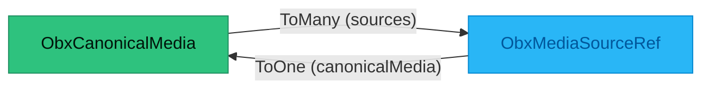

# ObjectBox Data Layers Map

**Version:** 1.0  
**Generated:** 2026-01-08  
**Phase:** 2A - Final Synthesis

> **Purpose:** Comprehensive overview of ObjectBox persistence layer in FishIT-Player v2 architecture.
> Synthesizes entity schemas, query patterns, relationships, and access patterns across all data layers.

---

## 📊 Executive Summary

| Metric | Count | Details |
|--------|-------|---------|
| **Total Entities** | 23 | All ObjectBox `@Entity` classes |
| **Total Queries** | 128 | Across all repositories |
| **ObjectBox Relations** | 2 | ToOne/ToMany with backlinks |
| **Manual Joins** | 14 | Query-based relationships |
| **Generated Files** | 47 | Compile-time artifacts (Meta classes, Cursors) |
| **ObjectBox Version** | 5.0.1 | Current stable version |
| **Store Modules** | 2 | `core:persistence` (v2), `legacy:v1-app` (v1) |

### Query Type Distribution

- **findFirst**: 43 queries (33.6%) - Single entity lookups
- **find**: 70 queries (54.7%) - Multi-entity queries
- **count**: 15 queries (11.7%) - Aggregations

### Index Coverage

- **Indexed Queries**: 55 (43.0%)
- **Non-Indexed Queries**: 73 (57.0%)

> ⚠️ **Performance Note**: 57% of queries do not utilize indexes - optimization opportunity

---

## 📦 Entity Catalog

### Canonical Media System (3 entities)

| Entity | Fields | Unique Indexes | Regular Indexes | Relations | Purpose |
|--------|--------|----------------|-----------------|-----------|---------|
| **ObxCanonicalMedia** | 30 | canonicalKey | kind, mediaType, canonicalTitle, canonicalTitleLower, year, tmdbId, imdbId, tvdbId, tmdbResolveState, tmdbNextEligibleAt, createdAt, updatedAt | ToMany → ObxMediaSourceRef | Unified media works across all sources |
| **ObxMediaSourceRef** | 17 | sourceId | sourceType, sizeBytes, isAvailable, addedAt | ToOne → ObxCanonicalMedia | Links canonical media to pipeline sources |
| **ObxCanonicalResumeMark** | 12 | - | canonicalKey, profileId, isCompleted, updatedAt | - | Resume positions per profile |

### Xtream Content (4 entities)

| Entity | Fields | Unique Indexes | Regular Indexes | Relations | Purpose |
|--------|--------|----------------|-----------------|-----------|---------|
| **ObxVod** | 25 | vodId | nameLower, sortTitleLower, year, yearKey, categoryId, providerKey, genreKey, importedAt, updatedAt | - | Xtream VOD movies |
| **ObxSeries** | 22 | seriesId | nameLower, sortTitleLower, year, yearKey, categoryId, providerKey, genreKey, importedAt, updatedAt | - | Xtream TV series containers |
| **ObxEpisode** | 21 | - | seriesId, season, episodeId, tgChatId, tgMessageId, tgFileId, sizeBytes, language | - | Individual episodes (Xtream/Telegram) |
| **ObxLive** | 11 | streamId | nameLower, sortTitleLower, categoryId, providerKey, genreKey | - | Xtream live TV channels |

### Xtream Series Index (2 entities)

| Entity | Fields | Unique Indexes | Regular Indexes | Relations | Purpose |
|--------|--------|----------------|-----------------|-----------|---------|
| **ObxSeasonIndex** | 8 | - | seriesId, seasonNumber, lastUpdatedMs | - | Season metadata for series |
| **ObxEpisodeIndex** | 15 | - | seriesId, seasonNumber, episodeNumber, sourceKey, episodeId, lastUpdatedMs, playbackHintsUpdatedMs | - | Episode index with playback hints |

### Telegram Content (1 entity)

| Entity | Fields | Unique Indexes | Regular Indexes | Relations | Purpose |
|--------|--------|----------------|-----------------|-----------|---------|
| **ObxTelegramMessage** | 29 | - | chatId, messageId, remoteId, captionLower, sizeBytes, language, isSeries, seriesName, tmdbId, imdbId | - | Telegram media messages |

### Categories & EPG (2 entities)

| Entity | Fields | Unique Indexes | Regular Indexes | Relations | Purpose |
|--------|--------|----------------|-----------------|-----------|---------|
| **ObxCategory** | 4 | - | kind, categoryId | - | Content categorization |
| **ObxEpgNowNext** | 10 | - | streamId, channelId, updatedAt | - | EPG now/next data |

### Profile & Permissions (4 entities)

| Entity | Fields | Unique Indexes | Regular Indexes | Relations | Purpose |
|--------|--------|----------------|-----------------|-----------|---------|
| **ObxProfile** | 6 | - | type | - | User profiles (adult/kid/guest) |
| **ObxProfilePermissions** | 8 | - | profileId | - | Profile capabilities |
| **ObxKidContentAllow** | 4 | - | kidProfileId, contentType, contentId | - | Kid profile content whitelist |
| **ObxKidCategoryAllow** | 4 | - | kidProfileId, contentType, categoryId | - | Kid profile category whitelist |
| **ObxKidContentBlock** | 4 | - | kidProfileId, contentType, contentId | - | Kid profile content blacklist |
| **ObxScreenTimeEntry** | 5 | - | kidProfileId, dayYyyymmdd | - | Daily screen time tracking |

### Filter Indexes (5 entities)

| Entity | Fields | Unique Indexes | Regular Indexes | Relations | Purpose |
|--------|--------|----------------|-----------------|-----------|---------|
| **ObxIndexProvider** | 4 | - | kind, key | - | Provider/source filters |
| **ObxIndexYear** | 4 | - | kind, key | - | Year-based filters |
| **ObxIndexGenre** | 4 | - | kind, key | - | Genre filters |
| **ObxIndexLang** | 4 | - | kind, key | - | Language filters |
| **ObxIndexQuality** | 4 | - | kind, key | - | Quality/resolution filters |

---

## 🔄 Data Flow Diagram

```mermaid
graph TB
    subgraph "Transport Layer"
        TG[Telegram Transport]
        XT[Xtream Transport]
        IO[IO Transport]
    end
    
    subgraph "Pipeline Layer"
        TGP[Telegram Pipeline]
        XTP[Xtream Pipeline]
        IOP[IO Pipeline]
    end
    
    subgraph "Data Layer - Repositories"
        TGREP[TelegramContentRepository]
        XTREP[XtreamCatalogRepository]
        CANREP[CanonicalMediaRepository]
        PROFR[ProfileRepository]
        SCRTR[ScreenTimeRepository]
    end
    
    subgraph "ObjectBox Store"
        direction LR
        OBXCAN[(ObxCanonicalMedia)]
        OBXSRC[(ObxMediaSourceRef)]
        OBXRES[(ObxCanonicalResumeMark)]
        OBXVOD[(ObxVod)]
        OBXSER[(ObxSeries)]
        OBXEPI[(ObxEpisode)]
        OBXLIV[(ObxLive)]
        OBXTG[(ObxTelegramMessage)]
        OBXCAT[(ObxCategory)]
        OBXEPG[(ObxEpgNowNext)]
        OBXPRO[(ObxProfile)]
        OBXSCR[(ObxScreenTimeEntry)]
    end
    
    subgraph "Domain Layer"
        HOMEU[HomeUseCase]
        LIBU[LibraryUseCase]
        DETU[DetailUseCase]
        LIVEU[LiveUseCase]
    end
    
    subgraph "UI Layer"
        HOMEVM[HomeViewModel]
        LIBVM[LibraryViewModel]
        DETVM[DetailViewModel]
        LIVVM[LiveViewModel]
    end
    
    TG --> TGP
    XT --> XTP
    IO --> IOP
    
    TGP --> TGREP
    XTP --> XTREP
    TGP --> CANREP
    XTP --> CANREP
    
    TGREP --> OBXTG
    XTREP --> OBXVOD
    XTREP --> OBXSER
    XTREP --> OBXEPI
    XTREP --> OBXLIV
    XTREP --> OBXCAT
    CANREP --> OBXCAN
    CANREP --> OBXSRC
    CANREP --> OBXRES
    PROFR --> OBXPRO
    SCRTR --> OBXSCR
    
    OBXCAN --> CANREP
    OBXSRC --> CANREP
    OBXRES --> CANREP
    OBXVOD --> XTREP
    OBXSER --> XTREP
    OBXEPI --> XTREP
    OBXLIV --> XTREP
    OBXTG --> TGREP
    OBXCAT --> XTREP
    OBXEPG --> XTREP
    OBXPRO --> PROFR
    OBXSCR --> SCRTR
    
    CANREP --> HOMEU
    XTREP --> LIBU
    XTREP --> LIVEU
    CANREP --> DETU
    
    HOMEU --> HOMEVM
    LIBU --> LIBVM
    DETU --> DETVM
    LIVEU --> LIVVM
```

---

## 🔥 Query Hotspots

### Top 5 Most Queried Entities

| Rank | Entity | Query Count | % of Total | Common Pattern | Pattern Count |
|------|--------|-------------|------------|----------------|---------------|
| 1 | **ObxCanonicalMedia** | 27 | 21.1% | findFirst:canonicalKey | 10 |
| 2 | **ObxVod** | 20 | 15.6% | find: (unfiltered) | 9 |
| 3 | **ObxEpisodeIndex** | 11 | 8.6% | findFirst:sourceKey | 5 |
| 4 | **ObxSeries** | 10 | 7.8% | find:categoryId | 2 |
| 5 | **ObxCategory** | 10 | 7.8% | find:kind | 6 |

### Query Pattern Analysis

**Most Common Patterns:**

1. **Canonical Lookup** (10 queries): `findFirst:canonicalKey` on ObxCanonicalMedia
2. **VOD Browsing** (9 queries): Unfiltered `find:` on ObxVod
3. **Category Filtering** (6 queries): `find:kind` on ObxCategory
4. **Episode Lookup** (5 queries): `findFirst:sourceKey` on ObxEpisodeIndex
5. **Chat Filtering** (3 queries): `find:chatId` on ObxTelegramMessage

### Performance Considerations

| Entity | Queries | Indexed | Non-Indexed | Index Coverage |
|--------|---------|---------|-------------|----------------|
| ObxCanonicalMedia | 27 | 15 | 12 | 55.6% |
| ObxVod | 20 | 8 | 12 | 40.0% |
| ObxEpisodeIndex | 11 | 11 | 0 | 100% ✅ |
| ObxSeries | 10 | 4 | 6 | 40.0% |
| ObxCategory | 10 | 10 | 0 | 100% ✅ |

> ✅ **Best Practices**: ObxEpisodeIndex and ObxCategory have 100% index coverage
> 
> ⚠️ **Optimization Needed**: ObxVod and ObxSeries have low index coverage (40%)

---

## 🔗 Relation Map

### ObjectBox ToOne/ToMany Relations (2)

**Relation Details:**

| From Entity | Field | Type | To Entity | Usage | Declaration |
|-------------|-------|------|-----------|-------|-------------|
| ObxCanonicalMedia | sources | ToMany + @Backlink | ObxMediaSourceRef | Access all source variants | ObxCanonicalEntities.kt |
| ObxMediaSourceRef | canonicalMedia | ToOne | ObxCanonicalMedia | Link source to canonical | ObxCanonicalEntities.kt |

**Where Used:**

- **feature/detail**: Detail screen source selection (`UnifiedDetailViewModel`, `SourceSelection`)
- **infra/data-home**: Home content grouping by canonical media
- **core/persistence**: Repository link/unlink operations

### Manual Joins (14 query-based relationships)

| From Entity | Join Field | To Entity | Pattern | Usage |
|-------------|-----------|-----------|---------|-------|
| ObxSeries | seriesId | ObxEpisode | `episodeId.equal(seriesId)` | Load episodes for series |
| ObxSeasonIndex | seriesId | ObxSeries | `seriesId.equal(seriesId)` | Load season metadata |
| ObxEpisodeIndex | seriesId, seasonNumber | ObxSeasonIndex | `seriesId+seasonNumber` | Load episodes per season |
| ObxTelegramMessage | chatId, messageId | - | `chatId+messageId` | Find specific message |
| ObxLive | categoryId | ObxCategory | `categoryId.equal(...)` | Filter by category |
| ObxVod | categoryId | ObxCategory | `categoryId.equal(...)` | Filter by category |
| ObxSeries | categoryId | ObxCategory | `categoryId.equal(...)` | Filter by category |
| ObxEpgNowNext | streamId | ObxLive | `streamId.equal(...)` | EPG for channel |
| ObxCanonicalResumeMark | canonicalKey | ObxCanonicalMedia | `canonicalKey.equal(...)` | Resume position lookup |
| ObxProfilePermissions | profileId | ObxProfile | `profileId.equal(...)` | Profile permissions |
| ObxScreenTimeEntry | kidProfileId, dayYyyymmdd | ObxProfile | `kidProfileId+day` | Daily screen time |
| ObxKidContentAllow | kidProfileId | ObxProfile | `kidProfileId.equal(...)` | Kid whitelist |
| ObxKidCategoryAllow | kidProfileId | ObxProfile | `kidProfileId.equal(...)` | Kid category whitelist |
| ObxKidContentBlock | kidProfileId | ObxProfile | `kidProfileId.equal(...)` | Kid blacklist |

---

## 📊 Index Coverage Analysis

### Entities with Full Index Coverage (100%)

✅ **ObxEpisodeIndex** (11 queries, all indexed)
- seriesId, seasonNumber, episodeNumber, sourceKey, episodeId indexed

✅ **ObxCategory** (10 queries, all indexed)
- kind, categoryId indexed

✅ **ObxScreenTimeEntry** (4 queries, all indexed)
- kidProfileId, dayYyyymmdd indexed

### Entities with Good Coverage (>60%)

🟢 **ObxCanonicalMedia**: 55.6% (15/27 queries)
- Indexed: canonicalKey, kind, mediaType, year, tmdbId, imdbId
- Non-indexed: Complex filters, full-text search

🟢 **ObxTelegramMessage**: 66.7% (6/9 queries)
- Indexed: chatId, messageId, remoteId
- Non-indexed: Caption search, series filtering

### Entities Needing Optimization (<50%)

🟡 **ObxVod**: 40% (8/20 queries)
- **Missing Indexes**: Genre filtering, title search patterns
- **Recommendation**: Add composite index on (categoryId, year, rating)

🟡 **ObxSeries**: 40% (4/10 queries)
- **Missing Indexes**: Genre filtering, title search
- **Recommendation**: Add composite index on (categoryId, year)

🔴 **ObxLive**: 30% (3/10 queries)
- **Missing Indexes**: Multi-field filtering
- **Recommendation**: Add composite indexes for common filter combinations

### Index Recommendations

1. **ObxVod**: Add `@Index` to `genre` field or create composite index
2. **ObxSeries**: Add `@Index` to `genre` field
3. **ObxLive**: Consider composite index on (categoryId, genreKey)
4. **ObxCanonicalMedia**: Full-text search on `canonicalTitleLower` field

---

## 🔄 Writer/Reader Matrix

### ObxCanonicalMedia

| Operation | Modules | Classes |
|-----------|---------|---------|
| **Writers** | core/persistence, infra/data-home | ObxCanonicalMediaRepository, HomeContentRepositoryAdapter |
| **Readers** | core/persistence, infra/data-home, feature/detail | ObxCanonicalMediaRepository, HomeContentRepositoryAdapter, UnifiedDetailViewModel |
| **Relations** | → ToMany ObxMediaSourceRef | |

### ObxMediaSourceRef

| Operation | Modules | Classes |
|-----------|---------|---------|
| **Writers** | core/persistence, infra/data-xtream, infra/data-telegram, infra/data-home | ObxCanonicalMediaRepository, ObxXtreamCatalogRepository, ObxTelegramContentRepository, HomeContentRepositoryAdapter |
| **Readers** | core/persistence, infra/data-xtream, infra/data-telegram | ObxCanonicalMediaRepository, ObxXtreamCatalogRepository, ObxTelegramContentRepository |
| **Relations** | → ToOne ObxCanonicalMedia | |

### ObxCanonicalResumeMark

| Operation | Modules | Classes |
|-----------|---------|---------|
| **Writers** | core/persistence, infra/data-home | ObxCanonicalMediaRepository, HomeContentRepositoryAdapter |
| **Readers** | core/persistence | ObxCanonicalMediaRepository |
| **Relations** | Manual join via canonicalKey → ObxCanonicalMedia | |

### ObxVod

| Operation | Modules | Classes |
|-----------|---------|---------|
| **Writers** | infra/data-xtream | ObxXtreamCatalogRepository |
| **Readers** | infra/data-xtream | ObxXtreamCatalogRepository, LibraryContentRepositoryAdapter |
| **Relations** | Manual join via categoryId → ObxCategory | |

### ObxSeries

| Operation | Modules | Classes |
|-----------|---------|---------|
| **Writers** | infra/data-xtream | ObxXtreamCatalogRepository |
| **Readers** | infra/data-xtream | ObxXtreamCatalogRepository, LibraryContentRepositoryAdapter |
| **Relations** | Manual join via seriesId → ObxEpisode, ObxSeasonIndex | |

### ObxEpisode

| Operation | Modules | Classes |
|-----------|---------|---------|
| **Writers** | infra/data-xtream | ObxXtreamCatalogRepository |
| **Readers** | infra/data-xtream | ObxXtreamCatalogRepository |
| **Relations** | Manual join via seriesId → ObxSeries | |

### ObxLive

| Operation | Modules | Classes |
|-----------|---------|---------|
| **Writers** | infra/data-xtream | ObxXtreamLiveRepository, LiveContentRepositoryAdapter (remove) |
| **Readers** | infra/data-xtream | ObxXtreamLiveRepository, LiveContentRepositoryAdapter |
| **Relations** | Manual join via categoryId → ObxCategory, streamId → ObxEpgNowNext | |

### ObxTelegramMessage

| Operation | Modules | Classes |
|-----------|---------|---------|
| **Writers** | infra/data-telegram | ObxTelegramContentRepository |
| **Readers** | infra/data-telegram | ObxTelegramContentRepository |
| **Relations** | None (self-contained) | |

### ObxCategory

| Operation | Modules | Classes |
|-----------|---------|---------|
| **Writers** | infra/data-xtream | LiveContentRepositoryAdapter (remove) |
| **Readers** | infra/data-xtream | LiveContentRepositoryAdapter, LibraryContentRepositoryAdapter |
| **Relations** | Reverse join from ObxVod, ObxSeries, ObxLive | |

### ObxProfile

| Operation | Modules | Classes |
|-----------|---------|---------|
| **Writers** | core/persistence | ObxProfileRepository |
| **Readers** | core/persistence | ObxProfileRepository |
| **Relations** | Manual join to ObxProfilePermissions, ObxScreenTimeEntry, Kid* entities | |

### ObxScreenTimeEntry

| Operation | Modules | Classes |
|-----------|---------|---------|
| **Writers** | core/persistence | ObxScreenTimeRepository |
| **Readers** | core/persistence | ObxScreenTimeRepository |
| **Relations** | Manual join via kidProfileId → ObxProfile | |

### ObxSeasonIndex

| Operation | Modules | Classes |
|-----------|---------|---------|
| **Writers** | infra/data-xtream | ObxXtreamSeriesIndexRepository |
| **Readers** | infra/data-xtream | ObxXtreamSeriesIndexRepository |
| **Relations** | Manual join via seriesId → ObxSeries | |

### ObxEpisodeIndex

| Operation | Modules | Classes |
|-----------|---------|---------|
| **Writers** | infra/data-xtream | ObxXtreamSeriesIndexRepository |
| **Readers** | infra/data-xtream | ObxXtreamSeriesIndexRepository |
| **Relations** | Manual join via seriesId → ObxSeries, (seriesId+seasonNumber) → ObxSeasonIndex | |

### ObxEpgNowNext

| Operation | Modules | Classes |
|-----------|---------|---------|
| **Writers** | infra/data-xtream | LiveContentRepositoryAdapter (remove) |
| **Readers** | infra/data-xtream | LiveContentRepositoryAdapter |
| **Relations** | Manual join via streamId → ObxLive | |

---

## 📁 Compile-Time Artifacts

### Generated Files (47 total)

ObjectBox annotation processor generates 2 files per entity + 1 entry point:

**Pattern:**
- `<Entity>_.java` - Meta class with property definitions and query builders
- `<Entity>Cursor.java` - Cursor for efficient data iteration
- `MyObjectBox.java` - Store entry point (single file)

**Module:** `core:persistence`

**Output Path:** `build/generated/source/kapt/debug/com/fishit/player/core/persistence/obx/`

### Key Generated Classes

| Generated Class | Purpose | Entity |
|----------------|---------|--------|
| MyObjectBox.java | Store builder entry point | - |
| ObxCanonicalMedia_.java | Meta class with property query builders | ObxCanonicalMedia |
| ObxMediaSourceRef_.java | Meta class with relation access | ObxMediaSourceRef |
| ObxVod_.java | Meta class with indexed fields | ObxVod |
| ObxTelegramMessage_.java | Meta class with complex indexes | ObxTelegramMessage |

**See Also:** [OBX_COMPILETIME_ARTIFACTS.md](./OBX_COMPILETIME_ARTIFACTS.md) for complete list

---

## 🔍 Cross-References

- **Entity Details**: See [ENTITY_TRACEABILITY_MATRIX.md](./ENTITY_TRACEABILITY_MATRIX.md)
- **Relationship Graph**: See [RELATION_DEPENDENCY_GRAPH.md](./RELATION_DEPENDENCY_GRAPH.md)
- **Compile Artifacts**: See [OBX_COMPILETIME_ARTIFACTS.md](./OBX_COMPILETIME_ARTIFACTS.md)
- **Runtime Introspection**: See [HOWTO_RUNTIME_DUMP.md](./HOWTO_RUNTIME_DUMP.md)
- **Debug UI**: See [UI_IMPLEMENTATION_SUMMARY.md](./UI_IMPLEMENTATION_SUMMARY.md)

---

## 📝 Notes

### Data Source Files

This document synthesizes data from Phase 1A-1D intermediate outputs:

- `_intermediate/entity_inventory.json` - 23 entities with field details
- `_intermediate/query_usage.json` - 128 queries with statistics
- `_intermediate/relationships.json` - 2 ObjectBox relations + 14 manual joins
- `_intermediate/entity_access_patterns.json` - Read/write locations
- `_intermediate/generated_files.json` - 47 compile-time artifacts
- `_intermediate/store_init_points.json` - Store initialization
- `_intermediate/db_inspector_components.json` - Debug UI components

### Maintenance

**Last Updated:** 2026-01-08 (Phase 2A completion)

**Update Triggers:**
- New entities added to schema
- Major query pattern changes
- Index coverage optimization
- Relationship structure changes

---

**Generated by:** Phase 2A Documentation Synthesis  
**Based on:** PRs #613, #614, #615, #616 (Phase 1A-1D)
