# ObjectBox Documentation Hub

**Version:** 2.0  
**Last Updated:** 2026-01-08  
**Status:** Phase 2A Complete

> **Central navigation for all ObjectBox persistence layer documentation in FishIT-Player v2.**

---

## 📚 Quick Navigation

### 🎯 Start Here

| Document | Purpose | When to Use |
|----------|---------|-------------|
| **[OBX_DATA_LAYERS_MAP.md](./OBX_DATA_LAYERS_MAP.md)** | Complete overview of ObjectBox data layer | Understanding entire persistence architecture |
| **[ENTITY_TRACEABILITY_MATRIX.md](./ENTITY_TRACEABILITY_MATRIX.md)** | Track all entity read/write operations | Impact analysis, refactoring, debugging |
| **[RELATION_DEPENDENCY_GRAPH.md](./RELATION_DEPENDENCY_GRAPH.md)** | Visual entity relationship mapping | Understanding data flow, join patterns |

### 🔧 Technical Details

| Document | Purpose | When to Use |
|----------|---------|-------------|
| **[OBX_COMPILETIME_ARTIFACTS.md](./OBX_COMPILETIME_ARTIFACTS.md)** | Generated files reference | Build troubleshooting, understanding codegen |
| **[HOWTO_RUNTIME_DUMP.md](./HOWTO_RUNTIME_DUMP.md)** | Runtime introspection guide | Debug DB state, analyze schema at runtime |
| **[UI_IMPLEMENTATION_SUMMARY.md](./UI_IMPLEMENTATION_SUMMARY.md)** | Debug UI components | Using DB inspector, visualizing data |

---

## 📊 Key Statistics

| Metric | Value | Document |
|--------|-------|----------|
| **Total Entities** | 23 | [OBX_DATA_LAYERS_MAP.md](./OBX_DATA_LAYERS_MAP.md#-executive-summary) |
| **Total Queries** | 128 | [OBX_DATA_LAYERS_MAP.md](./OBX_DATA_LAYERS_MAP.md#-query-hotspots) |
| **ObjectBox Relations** | 2 (ToOne/ToMany) | [RELATION_DEPENDENCY_GRAPH.md](./RELATION_DEPENDENCY_GRAPH.md#-objectbox-relations-native) |
| **Manual Joins** | 14 | [RELATION_DEPENDENCY_GRAPH.md](./RELATION_DEPENDENCY_GRAPH.md#-manual-joins-query-based) |
| **Generated Files** | 47 | [OBX_COMPILETIME_ARTIFACTS.md](./OBX_COMPILETIME_ARTIFACTS.md) |
| **ObjectBox Version** | 5.0.1 | All documents |

---

## 🗺️ Document Map

```mermaid
graph TB
    README[📖 README.md<br/>YOU ARE HERE]
    MAP[🎯 OBX_DATA_LAYERS_MAP.md<br/>Main Overview]
    TRACE[📊 ENTITY_TRACEABILITY_MATRIX.md<br/>Access Patterns]
    REL[🔗 RELATION_DEPENDENCY_GRAPH.md<br/>Relationships]
    COMPILE[🔧 OBX_COMPILETIME_ARTIFACTS.md<br/>Generated Files]
    RUNTIME[🏃 HOWTO_RUNTIME_DUMP.md<br/>Runtime Dump]
    UI[🖥️ UI_IMPLEMENTATION_SUMMARY.md<br/>Debug UI]
    
    README --> MAP
    README --> TRACE
    README --> REL
    README --> COMPILE
    README --> RUNTIME
    README --> UI
    
    MAP --> TRACE
    MAP --> REL
    TRACE --> MAP
    REL --> MAP
    
    style README fill:#2EC27E,stroke:#1E8F61,color:#00140A
    style MAP fill:#29B6F6,stroke:#0288D1,color:#01579B
    style TRACE fill:#FF7043,stroke:#E64A19,color:#FFFFFF
    style REL fill:#9E9E9E,stroke:#757575,color:#FFFFFF
```

---

## 🎓 How to Use This Documentation

### 📖 For New Developers

**Learning Path:**

1. **Start with the Overview**  
   Read [OBX_DATA_LAYERS_MAP.md](./OBX_DATA_LAYERS_MAP.md) to understand:
   - What entities exist (23 total)
   - How they're organized (Canonical, Xtream, Telegram, Profile systems)
   - Key statistics and metrics

2. **Explore Entity Details**  
   Use [ENTITY_TRACEABILITY_MATRIX.md](./ENTITY_TRACEABILITY_MATRIX.md) to:
   - Find which classes read/write each entity
   - Understand query patterns per entity
   - See most common access patterns

3. **Understand Relationships**  
   Study [RELATION_DEPENDENCY_GRAPH.md](./RELATION_DEPENDENCY_GRAPH.md) to:
   - See how entities connect (ToOne/ToMany vs manual joins)
   - Learn join patterns for series/episodes
   - Understand canonical media source linking

4. **Explore Debug Tools**  
   Review [UI_IMPLEMENTATION_SUMMARY.md](./UI_IMPLEMENTATION_SUMMARY.md) and [HOWTO_RUNTIME_DUMP.md](./HOWTO_RUNTIME_DUMP.md) to:
   - Use the DB inspector UI
   - Perform runtime introspection
   - Debug data issues

### 🔍 For Feature Development

**Scenario: Adding a new feature that needs to query media data**

1. Check [ENTITY_TRACEABILITY_MATRIX.md](./ENTITY_TRACEABILITY_MATRIX.md) to find:
   - Which entity stores the data you need
   - Which repositories already access it
   - Common query patterns to follow

2. Review [OBX_DATA_LAYERS_MAP.md - Query Hotspots](./OBX_DATA_LAYERS_MAP.md#-query-hotspots) to:
   - Understand performance implications
   - Check index coverage for your query
   - Avoid duplicate/redundant queries

3. Study [RELATION_DEPENDENCY_GRAPH.md](./RELATION_DEPENDENCY_GRAPH.md) if you need:
   - Multi-entity queries (joins)
   - Navigation between related entities
   - Understanding data flow

### 🔧 For Refactoring

**Scenario: Changing an entity schema**

1. Check [ENTITY_TRACEABILITY_MATRIX.md - Impact Analysis](./ENTITY_TRACEABILITY_MATRIX.md#-impact-analysis) for:
   - Query count (risk level)
   - Affected modules
   - All readers and writers

2. Review [RELATION_DEPENDENCY_GRAPH.md](./RELATION_DEPENDENCY_GRAPH.md) to:
   - Identify dependent entities
   - Check if relations need updating
   - Verify join patterns still work

3. Use [HOWTO_RUNTIME_DUMP.md](./HOWTO_RUNTIME_DUMP.md) to:
   - Verify schema changes at runtime
   - Test migration paths
   - Validate data integrity

### 🐛 For Debugging

**Scenario: Data not appearing in UI**

1. Use [HOWTO_RUNTIME_DUMP.md](./HOWTO_RUNTIME_DUMP.md) to:
   - Dump current DB state
   - Check if data exists in ObjectBox
   - Verify entity counts

2. Check [ENTITY_TRACEABILITY_MATRIX.md](./ENTITY_TRACEABILITY_MATRIX.md) to:
   - Find where entity is written
   - Verify write path is executed
   - Check for query errors

3. Review [OBX_DATA_LAYERS_MAP.md - Index Coverage](./OBX_DATA_LAYERS_MAP.md#-index-coverage-analysis) to:
   - Check if queries use indexes
   - Identify performance bottlenecks

### ⚡ For Performance Optimization

**Scenario: Slow queries**

1. Check [OBX_DATA_LAYERS_MAP.md - Index Coverage Analysis](./OBX_DATA_LAYERS_MAP.md#-index-coverage-analysis):
   - Identify non-indexed queries
   - Find entities with low index coverage
   - Review optimization recommendations

2. Review [ENTITY_TRACEABILITY_MATRIX.md](./ENTITY_TRACEABILITY_MATRIX.md):
   - Find most common query patterns
   - Check if indexes match patterns
   - Identify redundant queries

3. Study [RELATION_DEPENDENCY_GRAPH.md - Join Pattern Analysis](./RELATION_DEPENDENCY_GRAPH.md#-join-pattern-analysis):
   - Check if joins use composite indexes
   - Consider adding missing indexes
   - Evaluate if manual joins should become relations

---

## 📁 Phase History

### Phase 1A - Entity Discovery
- **PR:** #613
- **Deliverables:** entity_inventory.json, store_init_points.json, db_inspector_components.json
- **Status:** ✅ Merged

### Phase 1B - Compile-Time Artifacts
- **PR:** #614
- **Deliverables:** generated_files.json, OBX_COMPILETIME_ARTIFACTS.md
- **Status:** ✅ Merged

### Phase 1C - Runtime Introspection
- **PR:** #615
- **Deliverables:** ObjectBoxIntrospectionDump.kt, HOWTO_RUNTIME_DUMP.md
- **Status:** ✅ Merged

### Phase 1D - Relationships & Queries
- **PR:** #616
- **Deliverables:** relationships.json, query_usage.json, entity_access_patterns.json
- **Status:** ✅ Merged

### Phase 2A - Final Synthesis (Current)
- **PR:** TBD
- **Deliverables:** 
  - OBX_DATA_LAYERS_MAP.md (main overview)
  - ENTITY_TRACEABILITY_MATRIX.md (access patterns)
  - RELATION_DEPENDENCY_GRAPH.md (relationships)
  - README.md (this file)
- **Status:** 🔄 In Progress

---

## 🔍 Search & Find

### By Entity Name

Find documentation about a specific entity:

| Entity | Primary Doc | Also See |
|--------|-------------|----------|
| ObxCanonicalMedia | [Traceability Matrix](./ENTITY_TRACEABILITY_MATRIX.md#obxcanonicalmedia) | [Data Layers Map - Query Hotspots](./OBX_DATA_LAYERS_MAP.md#-query-hotspots) |
| ObxMediaSourceRef | [Relation Graph](./RELATION_DEPENDENCY_GRAPH.md#canonical-media-system) | [Traceability Matrix](./ENTITY_TRACEABILITY_MATRIX.md#obxmediasourceref) |
| ObxVod | [Traceability Matrix](./ENTITY_TRACEABILITY_MATRIX.md#obxvod) | [Data Layers Map - Entity Catalog](./OBX_DATA_LAYERS_MAP.md#-entity-catalog) |
| ObxSeries | [Relation Graph - Series Structure](./RELATION_DEPENDENCY_GRAPH.md#xtream-series-structure) | [Traceability Matrix](./ENTITY_TRACEABILITY_MATRIX.md#obxseries) |
| ObxTelegramMessage | [Traceability Matrix](./ENTITY_TRACEABILITY_MATRIX.md#obxtelegrammessage) | [Data Layers Map](./OBX_DATA_LAYERS_MAP.md#telegram-content-1-entity) |

### By Topic

| Topic | Document | Section |
|-------|----------|---------|
| Query Performance | [OBX_DATA_LAYERS_MAP.md](./OBX_DATA_LAYERS_MAP.md) | Index Coverage Analysis |
| Entity Relationships | [RELATION_DEPENDENCY_GRAPH.md](./RELATION_DEPENDENCY_GRAPH.md) | Complete Relationship Overview |
| Write Operations | [ENTITY_TRACEABILITY_MATRIX.md](./ENTITY_TRACEABILITY_MATRIX.md) | Writers column in matrix |
| Generated Code | [OBX_COMPILETIME_ARTIFACTS.md](./OBX_COMPILETIME_ARTIFACTS.md) | Full file listing |
| Debug Tools | [UI_IMPLEMENTATION_SUMMARY.md](./UI_IMPLEMENTATION_SUMMARY.md) | Inspector UI |
| Runtime Schema | [HOWTO_RUNTIME_DUMP.md](./HOWTO_RUNTIME_DUMP.md) | Usage examples |

### By Module

| Module | Entities Accessed | Primary Doc |
|--------|-------------------|-------------|
| core/persistence | All entities | [ENTITY_TRACEABILITY_MATRIX.md](./ENTITY_TRACEABILITY_MATRIX.md) |
| infra/data-xtream | ObxVod, ObxSeries, ObxEpisode, ObxLive, ObxCategory | [Data Layers Map - Xtream Content](./OBX_DATA_LAYERS_MAP.md#xtream-content-4-entities) |
| infra/data-telegram | ObxTelegramMessage | [Traceability Matrix](./ENTITY_TRACEABILITY_MATRIX.md#obxtelegrammessage) |
| infra/data-home | ObxCanonicalMedia, ObxMediaSourceRef | [Traceability Matrix](./ENTITY_TRACEABILITY_MATRIX.md#obxcanonicalmedia) |
| feature/detail | ObxCanonicalMedia (read-only) | [Relation Graph - Usage](./RELATION_DEPENDENCY_GRAPH.md#usage-locations) |

---

## 🔗 External Resources

### ObjectBox Documentation

- [ObjectBox Kotlin Docs](https://docs.objectbox.io/kotlin)
- [Query API Reference](https://docs.objectbox.io/queries)
- [Relations Guide](https://docs.objectbox.io/relations)
- [Performance Best Practices](https://docs.objectbox.io/performance)

### FishIT-Player Architecture

- Architecture overview: `/docs/v2/ARCHITECTURE_OVERVIEW.md`
- Module taxonomy: `/contracts/GLOSSARY_v2_naming_and_modules.md`
- Data layer instructions: `.github/instructions/infra-data.instructions.md`
- Core persistence instructions: `.github/instructions/core-persistence.instructions.md`

---

## 📝 Maintenance

### When to Update

This documentation should be updated when:

- ✅ New entities are added to schema
- ✅ Entities are removed or renamed
- ✅ Major refactoring of repositories
- ✅ Relationship structure changes (ToOne/ToMany added/removed)
- ✅ Query patterns significantly change
- ✅ ObjectBox version upgrade

### How to Update

1. Run Phase 1 scripts to regenerate intermediate JSON files:
   - Entity inventory scanner
   - Query usage analyzer
   - Relationship mapper
   - Access pattern tracker

2. Re-run Phase 2A synthesis to update final documents:
   - Regenerate OBX_DATA_LAYERS_MAP.md
   - Update ENTITY_TRACEABILITY_MATRIX.md
   - Refresh RELATION_DEPENDENCY_GRAPH.md

3. Verify all cross-links still work

4. Update version numbers and timestamps

---

## 📧 Questions & Feedback

**Documentation Issues:** File an issue with label `documentation`

**ObjectBox Questions:** Check [ObjectBox Discussions](https://github.com/objectbox/objectbox-java/discussions)

**Architecture Questions:** See `/docs/v2/ARCHITECTURE_OVERVIEW.md` or consult the dev team

---

**Last Updated:** 2026-01-08  
**Documentation Version:** 2.0  
**Phase:** 2A Complete
