# FishIT-Player v2 Module Dependency Graph

> **Generated:** 2024-12-30  
> **Branch:** `architecture/v2-bootstrap`  
> **Total Modules:** 37  
> **Total Edges:** 202

This document provides a human-readable summary of all v2 module dependencies.
For the full graph, see [DEPENDENCY_GRAPH.dot](DEPENDENCY_GRAPH.dot) (Graphviz) or [DEPENDENCY_GRAPH.mmd](DEPENDENCY_GRAPH.mmd) (Mermaid).

---

## Global Dependency Graph (Mermaid)

```mermaid
flowchart TB
    subgraph APP["App Layer"]
        app-v2
    end
    
    subgraph FEATURE["Feature Layer"]
        feature:home
        feature:library
        feature:live
        feature:detail
        feature:telegram-media
        feature:audiobooks
        feature:settings
        feature:onboarding
    end
    
    subgraph CORE["Core Layer"]
        core:model
        core:player-model
        core:feature-api
        core:source-activation-api
        core:persistence
        core:metadata-normalizer
        core:catalog-sync
        core:firebase
        core:ui-imaging
        core:ui-theme
        core:ui-layout
        core:app-startup
    end
    
    subgraph PLAYBACK["Playback Layer"]
        playback:domain
        playback:telegram
        playback:xtream
    end
    
    subgraph PLAYER["Player Layer"]
        player:ui
        player:ui-api
        player:internal
        player:miniplayer
        player:nextlib-codecs
    end
    
    subgraph PIPELINE["Pipeline Layer"]
        pipeline:telegram
        pipeline:xtream
        pipeline:io
        pipeline:audiobook
    end
    
    subgraph INFRA["Infrastructure Layer"]
        infra:logging
        infra:cache
        infra:tooling
        infra:transport-telegram
        infra:transport-xtream
        infra:data-telegram
        infra:data-xtream
        infra:data-home
        infra:imaging
        infra:work
    end
    
    %% App dependencies
    app-v2 --> core:model
    app-v2 --> core:player-model
    app-v2 --> core:feature-api
    app-v2 --> core:persistence
    app-v2 --> core:catalog-sync
    app-v2 --> core:firebase
    app-v2 --> core:app-startup
    app-v2 --> playback:domain
    app-v2 --> playback:xtream
    app-v2 --> playback:telegram
    app-v2 --> player:ui
    app-v2 --> player:internal
    app-v2 --> feature:home
    app-v2 --> feature:library
    app-v2 --> feature:settings
    app-v2 --> infra:logging
    
    %% Core cross-dependencies
    core:catalog-sync --> core:model
    core:catalog-sync --> core:metadata-normalizer
    core:catalog-sync --> pipeline:telegram
    core:catalog-sync --> pipeline:xtream
    core:persistence --> core:model
    core:metadata-normalizer --> core:model
    core:ui-layout --> core:ui-theme
    core:ui-layout --> core:ui-imaging
    
    %% Player dependencies
    player:internal --> playback:domain
    player:internal --> playback:telegram
    player:internal --> playback:xtream
    player:ui --> player:internal
    
    %% Pipeline dependencies
    pipeline:telegram --> infra:transport-telegram
    pipeline:xtream --> infra:transport-xtream
    
    %% Data dependencies
    infra:data-telegram --> core:persistence
    infra:data-xtream --> core:persistence
    infra:data-home --> infra:data-telegram
    infra:data-home --> infra:data-xtream
```

---

## Per-Layer Breakdown

### App Layer (`app-v2`)

| Module | Dependencies (37 total) |
|--------|------------------------|
| **app-v2** | core:model, core:player-model, core:feature-api, core:source-activation-api, core:persistence, core:catalog-sync, core:firebase, core:app-startup, core:metadata-normalizer, playback:domain, playback:xtream, playback:telegram, player:ui, player:ui-api, player:internal, player:miniplayer, player:nextlib-codecs, pipeline:telegram, pipeline:xtream, pipeline:io, pipeline:audiobook, feature:home, feature:library, feature:live, feature:detail, feature:telegram-media, feature:audiobooks, feature:settings, feature:onboarding, core:ui-theme, core:ui-layout, core:ui-imaging, infra:logging, infra:imaging, infra:cache, infra:tooling, infra:transport-telegram, infra:transport-xtream, infra:data-telegram, infra:data-xtream, infra:data-home, infra:work |

---

### Core Layer (`core/*`)

| Module | Dependencies |
|--------|--------------|
| **core:model** | *(none - leaf module)* |
| **core:player-model** | *(none - leaf module)* |
| **core:feature-api** | *(none - leaf module)* |
| **core:source-activation-api** | *(none - leaf module)* |
| **core:persistence** | core:model, infra:logging |
| **core:metadata-normalizer** | core:model, infra:logging |
| **core:catalog-sync** | core:model, core:source-activation-api, core:metadata-normalizer, core:persistence, infra:logging, infra:data-telegram, infra:data-xtream, pipeline:telegram, pipeline:xtream |
| **core:firebase** | core:model, core:persistence |
| **core:ui-imaging** | core:model, infra:logging |
| **core:ui-theme** | *(none - leaf module)* |
| **core:ui-layout** | core:model, core:ui-theme, core:ui-imaging |
| **core:app-startup** | core:model, infra:logging, infra:transport-telegram, infra:transport-xtream, pipeline:telegram, pipeline:xtream |

---

### Playback Layer (`playback/*`)

| Module | Dependencies |
|--------|--------------|
| **playback:domain** | core:model, core:player-model, core:persistence, infra:logging |
| **playback:telegram** | core:model, core:player-model, infra:logging, infra:transport-telegram, playback:domain |
| **playback:xtream** | core:model, core:player-model, infra:logging, infra:transport-xtream, playback:domain |

---

### Player Layer (`player/*`)

| Module | Dependencies |
|--------|--------------|
| **player:ui-api** | core:player-model |
| **player:ui** | core:player-model, infra:logging, playback:domain, player:internal |
| **player:internal** | core:model, core:player-model, player:ui-api, playback:domain, playback:telegram, playback:xtream, infra:logging, infra:transport-telegram, player:nextlib-codecs |
| **player:miniplayer** | core:player-model, player:ui-api, player:internal, infra:logging |
| **player:nextlib-codecs** | *(external deps only)* |

---

### Pipeline Layer (`pipeline/*`)

| Module | Dependencies |
|--------|--------------|
| **pipeline:telegram** | core:model, core:feature-api, infra:logging, infra:transport-telegram (api) |
| **pipeline:xtream** | core:model, infra:logging, infra:transport-xtream (api) |
| **pipeline:io** | core:model, core:player-model, core:persistence, infra:logging |
| **pipeline:audiobook** | core:model, core:persistence, infra:logging |

---

### Feature Layer (`feature/*`)

| Module | Dependencies |
|--------|--------------|
| **feature:home** | core:model, core:player-model, core:persistence, core:source-activation-api, core:catalog-sync, core:ui-theme, core:ui-layout, core:ui-imaging, playback:domain, player:ui, infra:logging |
| **feature:library** | core:model, core:persistence, playback:domain, player:internal, pipeline:xtream, pipeline:telegram, pipeline:io, infra:logging |
| **feature:live** | core:model, core:persistence, playback:domain, player:internal, pipeline:xtream, infra:logging |
| **feature:detail** | core:model, core:player-model, core:ui-theme, core:ui-layout, core:ui-imaging, core:metadata-normalizer, playback:domain, infra:logging, infra:transport-xtream, pipeline:xtream |
| **feature:telegram-media** | core:model, core:feature-api, core:persistence, core:player-model, playback:domain, infra:logging |
| **feature:audiobooks** | core:model, core:persistence, playback:domain, player:internal, pipeline:audiobook, infra:logging |
| **feature:settings** | core:model, core:persistence, core:firebase, core:source-activation-api, core:catalog-sync, core:metadata-normalizer, playback:domain, infra:logging, infra:cache |
| **feature:onboarding** | core:model, core:ui-theme, core:ui-layout, core:feature-api, infra:logging |

---

### Infrastructure Layer (`infra/*`)

| Module | Dependencies |
|--------|--------------|
| **infra:logging** | *(none - leaf module)* |
| **infra:cache** | *(external deps only)* |
| **infra:tooling** | *(external deps only)* |
| **infra:transport-telegram** | core:model, infra:logging |
| **infra:transport-xtream** | core:model, infra:logging |
| **infra:data-telegram** | core:model, core:persistence, core:feature-api, infra:logging, infra:transport-telegram, feature:telegram-media |
| **infra:data-xtream** | core:model, core:source-activation-api, core:persistence (api), infra:logging, infra:transport-xtream, feature:onboarding, feature:library, feature:live |
| **infra:data-home** | core:model, core:persistence, infra:logging, feature:home, infra:data-telegram, infra:data-xtream |
| **infra:imaging** | core:model, infra:logging |
| **infra:work** | core:source-activation-api, core:catalog-sync, infra:logging |

---

## Top 20 Most-Connected Modules

Ranked by total connections (in-degree + out-degree):

| Rank | Module | In | Out | Total |
|------|--------|---:|----:|------:|
| 1 | **core:model** | 30 | 0 | 30 |
| 2 | **infra:logging** | 28 | 0 | 28 |
| 3 | **app-v2** | 0 | 41 | 41 |
| 4 | **core:persistence** | 14 | 2 | 16 |
| 5 | **playback:domain** | 11 | 4 | 15 |
| 6 | **core:player-model** | 11 | 0 | 11 |
| 7 | **player:internal** | 5 | 9 | 14 |
| 8 | **infra:transport-xtream** | 5 | 2 | 7 |
| 9 | **infra:transport-telegram** | 5 | 2 | 7 |
| 10 | **pipeline:xtream** | 5 | 3 | 8 |
| 11 | **pipeline:telegram** | 4 | 4 | 8 |
| 12 | **core:catalog-sync** | 4 | 9 | 13 |
| 13 | **feature:home** | 1 | 11 | 12 |
| 14 | **core:ui-imaging** | 4 | 2 | 6 |
| 15 | **core:ui-theme** | 4 | 0 | 4 |
| 16 | **core:ui-layout** | 4 | 3 | 7 |
| 17 | **playback:xtream** | 2 | 5 | 7 |
| 18 | **playback:telegram** | 2 | 5 | 7 |
| 19 | **infra:data-xtream** | 2 | 8 | 10 |
| 20 | **core:feature-api** | 4 | 0 | 4 |

---

## Layer Statistics

| Layer | Modules | Internal Edges | External Edges |
|-------|--------:|---------------:|---------------:|
| App | 1 | 0 | 41 |
| Core | 12 | 9 | 6 |
| Playback | 3 | 2 | 11 |
| Player | 5 | 4 | 10 |
| Pipeline | 4 | 0 | 12 |
| Feature | 8 | 0 | 56 |
| Infrastructure | 10 | 3 | 16 |

---

## Related Documents

- [DEPENDENCY_GRAPH.dot](DEPENDENCY_GRAPH.dot) - Full Graphviz source
- [DEPENDENCY_GRAPH.mmd](DEPENDENCY_GRAPH.mmd) - Full Mermaid source
- [MODULE_RESPONSIBILITY_MAP.md](MODULE_RESPONSIBILITY_MAP.md) - Module ownership tables
- [FLOW_XTREAM_END_TO_END.md](FLOW_XTREAM_END_TO_END.md) - Xtream call chains
