# Module Dependencies

**Generated on 2026-02-15 — DO NOT EDIT MANUALLY**

> Regenerate with: `./gradlew :tools:doc-generator:run --args="--deps"`
> Or: `./gradlew generateModuleDocs`

## Overview

| Layer | Modules |
|-------|---------|
| **App** | 1 modules |
| **Feature** | 8 modules |
| **Core** | 21 modules |
| **Player/Playback** | 8 modules |
| **Pipeline** | 4 modules |
| **Infrastructure** | 15 modules |
| **Tools** | 2 modules |

**Total:** 59 modules

## Dependency Graph

```mermaid
graph TD
    subgraph App
        app-v2["app-v2"]
    end
    subgraph Feature
        feature_home["feature:home"]
        feature_library["feature:library"]
        feature_live["feature:live"]
        feature_detail["feature:detail"]
        feature_telegram-media["feature:telegram-media"]
        feature_audiobooks["feature:audiobooks"]
        feature_settings["feature:settings"]
        feature_onboarding["feature:onboarding"]
    end
    subgraph Core
        core_model["core:model"]
        core_player-model["core:player-model"]
        core_device-api["core:device-api"]
        core_feature-api["core:feature-api"]
        core_home-domain["core:home-domain"]
        core_library-domain["core:library-domain"]
        core_live-domain["core:live-domain"]
        core_telegrammedia-domain["core:telegrammedia-domain"]
        core_onboarding-domain["core:onboarding-domain"]
        core_detail-domain["core:detail-domain"]
        core_source-activation-api["core:source-activation-api"]
        core_persistence["core:persistence"]
        core_metadata-normalizer["core:metadata-normalizer"]
        core_catalog-sync["core:catalog-sync"]
        core_sync-common["core:sync-common"]
        core_firebase["core:firebase"]
        core_ui-imaging["core:ui-imaging"]
        core_ui-theme["core:ui-theme"]
        core_ui-layout["core:ui-layout"]
        core_app-startup["core:app-startup"]
        core_debug-settings["core:debug-settings"]
    end
    subgraph Player_Playback
        playback_domain["playback:domain"]
        playback_telegram["playback:telegram"]
        playback_xtream["playback:xtream"]
        player_ui["player:ui"]
        player_ui-api["player:ui-api"]
        player_internal["player:internal"]
        player_miniplayer["player:miniplayer"]
        player_nextlib-codecs["player:nextlib-codecs"]
    end
    subgraph Pipeline
        pipeline_telegram["pipeline:telegram"]
        pipeline_xtream["pipeline:xtream"]
        pipeline_io["pipeline:io"]
        pipeline_audiobook["pipeline:audiobook"]
    end
    subgraph Infrastructure
        infra_networking["infra:networking"]
        infra_logging["infra:logging"]
        infra_api-priority["infra:api-priority"]
        infra_cache["infra:cache"]
        infra_device-android["infra:device-android"]
        infra_tooling["infra:tooling"]
        infra_transport-telegram["infra:transport-telegram"]
        infra_transport-xtream["infra:transport-xtream"]
        infra_data-telegram["infra:data-telegram"]
        infra_data-xtream["infra:data-xtream"]
        infra_data-home["infra:data-home"]
        infra_data-detail["infra:data-detail"]
        infra_data-nx["infra:data-nx"]
        infra_imaging["infra:imaging"]
        infra_work["infra:work"]
    end
    subgraph Tools
        tools_mcp-server["tools:mcp-server"]
        tools_doc-generator["tools:doc-generator"]
    end
    app-v2 --> core_model
    app-v2 --> core_player-model
    app-v2 --> core_feature-api
    app-v2 --> core_source-activation-api
    app-v2 --> core_persistence
    app-v2 --> core_catalog-sync
    app-v2 --> core_firebase
    app-v2 --> core_app-startup
    app-v2 --> core_home-domain
    app-v2 --> core_library-domain
    app-v2 --> core_live-domain
    app-v2 --> core_detail-domain
    app-v2 --> core_telegrammedia-domain
    app-v2 --> core_onboarding-domain
    app-v2 --> core_metadata-normalizer
    app-v2 --> playback_domain
    app-v2 --> playback_xtream
    app-v2 --> playback_telegram
    app-v2 --> player_ui
    app-v2 --> player_ui-api
    app-v2 --> player_internal
    app-v2 --> player_miniplayer
    app-v2 --> player_nextlib-codecs
    app-v2 --> pipeline_telegram
    app-v2 --> pipeline_xtream
    app-v2 --> pipeline_io
    app-v2 --> pipeline_audiobook
    app-v2 --> feature_home
    app-v2 --> feature_library
    app-v2 --> feature_live
    app-v2 --> feature_detail
    app-v2 --> feature_telegram-media
    app-v2 --> feature_audiobooks
    app-v2 --> feature_settings
    app-v2 --> feature_onboarding
    app-v2 --> core_ui-theme
    app-v2 --> core_ui-layout
    app-v2 --> core_ui-imaging
    app-v2 --> infra_networking
    app-v2 --> infra_logging
    app-v2 --> infra_imaging
    app-v2 --> infra_cache
    app-v2 --> infra_tooling
    app-v2 --> infra_transport-telegram
    app-v2 --> infra_transport-xtream
    app-v2 --> infra_data-telegram
    app-v2 --> infra_data-xtream
    app-v2 --> infra_data-detail
    app-v2 --> infra_data-home
    app-v2 --> infra_data-nx
    app-v2 --> infra_work
    app-v2 --> infra_api-priority
    core_home-domain --> core_model
    core_library-domain --> core_model
    core_live-domain --> core_model
    core_telegrammedia-domain --> core_model
    core_detail-domain --> core_model
    core_persistence --> core_model
    core_persistence --> core_device-api
    core_persistence --> infra_logging
    core_metadata-normalizer --> core_model
    core_metadata-normalizer --> infra_logging
    core_catalog-sync --> core_model
    core_catalog-sync --> core_sync-common
    core_catalog-sync --> core_source-activation-api
    core_catalog-sync --> core_feature-api
    core_catalog-sync --> core_metadata-normalizer
    core_catalog-sync --> core_persistence
    core_catalog-sync --> infra_logging
    core_catalog-sync --> infra_data-telegram
    core_catalog-sync --> infra_data-xtream
    core_catalog-sync --> infra_data-nx
    core_catalog-sync --> pipeline_telegram
    core_catalog-sync --> pipeline_xtream
    core_sync-common --> core_model
    core_sync-common --> infra_logging
    core_firebase --> core_model
    core_firebase --> core_persistence
    core_ui-imaging --> core_model
    core_ui-imaging --> infra_logging
    core_ui-layout --> core_model
    core_ui-layout --> core_ui-theme
    core_ui-layout --> core_ui-imaging
    core_app-startup --> core_model
    core_app-startup --> infra_logging
    core_app-startup --> infra_transport-telegram
    core_app-startup --> infra_transport-xtream
    core_app-startup --> pipeline_telegram
    core_app-startup --> pipeline_xtream
    core_debug-settings --> infra_logging
    playback_domain --> core_model
    playback_domain --> core_player-model
    playback_domain --> core_persistence
    playback_domain --> infra_logging
    playback_telegram --> core_model
    playback_telegram --> core_player-model
    playback_telegram --> infra_logging
    playback_telegram --> infra_transport-telegram
    playback_telegram --> playback_domain
    playback_xtream --> core_model
    playback_xtream --> core_player-model
    playback_xtream --> infra_logging
    playback_xtream --> infra_transport-xtream
    playback_xtream --> playback_domain
    player_ui --> core_player-model
    player_ui --> infra_logging
    player_ui --> playback_domain
    player_ui --> player_internal
    player_ui-api --> core_player-model
    player_internal --> core_model
    player_internal --> core_player-model
    player_internal --> player_ui-api
    player_internal --> playback_domain
    player_internal --> playback_telegram
    player_internal --> playback_xtream
    player_internal --> infra_logging
    player_internal --> infra_transport-telegram
    player_internal --> player_nextlib-codecs
    player_miniplayer --> core_player-model
    player_miniplayer --> player_ui-api
    player_miniplayer --> player_internal
    player_miniplayer --> infra_logging
    player_nextlib-codecs --> infra_logging
    pipeline_telegram --> core_model
    pipeline_telegram --> core_feature-api
    pipeline_telegram --> infra_logging
    pipeline_telegram --> infra_transport-telegram
    pipeline_xtream --> core_model
    pipeline_xtream --> infra_logging
    pipeline_xtream --> infra_transport-xtream
    pipeline_io --> core_model
    pipeline_io --> core_player-model
    pipeline_io --> core_persistence
    pipeline_io --> infra_logging
    pipeline_audiobook --> core_model
    pipeline_audiobook --> core_persistence
    pipeline_audiobook --> infra_logging
    feature_home --> core_model
    feature_home --> core_home-domain
    feature_home --> core_player-model
    feature_home --> core_source-activation-api
    feature_home --> core_catalog-sync
    feature_home --> core_persistence
    feature_home --> core_ui-theme
    feature_home --> core_ui-layout
    feature_home --> core_ui-imaging
    feature_home --> playback_domain
    feature_home --> player_ui
    feature_home --> infra_logging
    feature_library --> core_model
    feature_library --> core_library-domain
    feature_library --> core_ui-layout
    feature_library --> playback_domain
    feature_library --> infra_logging
    feature_live --> core_model
    feature_live --> core_live-domain
    feature_live --> playback_domain
    feature_live --> infra_logging
    feature_detail --> core_model
    feature_detail --> core_player-model
    feature_detail --> core_ui-theme
    feature_detail --> core_ui-layout
    feature_detail --> core_ui-imaging
    feature_detail --> core_metadata-normalizer
    feature_detail --> core_detail-domain
    feature_detail --> playback_domain
    feature_detail --> infra_logging
    feature_detail --> infra_api-priority
    feature_telegram-media --> core_model
    feature_telegram-media --> core_telegrammedia-domain
    feature_telegram-media --> core_feature-api
    feature_telegram-media --> core_player-model
    feature_telegram-media --> core_ui-imaging
    feature_telegram-media --> playback_domain
    feature_telegram-media --> infra_logging
    feature_audiobooks --> core_model
    feature_audiobooks --> infra_logging
    feature_settings --> core_model
    feature_settings --> core_persistence
    feature_settings --> core_firebase
    feature_settings --> core_source-activation-api
    feature_settings --> core_catalog-sync
    feature_settings --> core_metadata-normalizer
    feature_settings --> core_feature-api
    feature_settings --> playback_domain
    feature_settings --> infra_logging
    feature_settings --> infra_cache
    feature_settings --> infra_data-telegram
    feature_settings --> infra_data-xtream
    feature_settings --> infra_transport-xtream
    feature_onboarding --> core_model
    feature_onboarding --> core_onboarding-domain
    feature_onboarding --> core_catalog-sync
    feature_onboarding --> core_source-activation-api
    feature_onboarding --> core_ui-theme
    feature_onboarding --> core_ui-layout
    feature_onboarding --> core_feature-api
    feature_onboarding --> infra_logging
    infra_api-priority --> infra_logging
    infra_cache --> infra_logging
    infra_cache --> core_ui-imaging
    infra_device-android --> core_device-api
    infra_tooling --> core_model
    infra_transport-telegram --> core_model
    infra_transport-telegram --> core_ui-imaging
    infra_transport-telegram --> infra_logging
    infra_transport-xtream --> core_model
    infra_transport-xtream --> core_device-api
    infra_transport-xtream --> infra_device-android
    infra_transport-xtream --> infra_logging
    infra_transport-xtream --> infra_networking
    infra_data-telegram --> core_model
    infra_data-telegram --> core_persistence
    infra_data-telegram --> core_feature-api
    infra_data-telegram --> core_telegrammedia-domain
    infra_data-telegram --> infra_logging
    infra_data-telegram --> infra_transport-telegram
    infra_data-xtream --> core_model
    infra_data-xtream --> core_source-activation-api
    infra_data-xtream --> core_onboarding-domain
    infra_data-xtream --> core_library-domain
    infra_data-xtream --> core_live-domain
    infra_data-xtream --> core_detail-domain
    infra_data-xtream --> core_persistence
    infra_data-xtream --> infra_logging
    infra_data-xtream --> infra_transport-xtream
    infra_data-home --> core_model
    infra_data-home --> core_persistence
    infra_data-home --> infra_logging
    infra_data-home --> core_home-domain
    infra_data-home --> infra_data-telegram
    infra_data-home --> infra_data-xtream
    infra_data-detail --> core_model
    infra_data-detail --> core_detail-domain
    infra_data-detail --> core_metadata-normalizer
    infra_data-detail --> infra_data-nx
    infra_data-detail --> infra_logging
    infra_data-detail --> infra_api-priority
    infra_data-detail --> infra_transport-xtream
    infra_data-detail --> pipeline_xtream
    infra_data-nx --> core_model
    infra_data-nx --> core_persistence
    infra_data-nx --> core_detail-domain
    infra_data-nx --> core_home-domain
    infra_data-nx --> core_library-domain
    infra_data-nx --> core_live-domain
    infra_data-nx --> core_telegrammedia-domain
    infra_data-nx --> infra_logging
    infra_data-nx --> infra_data-xtream
    infra_imaging --> core_model
    infra_imaging --> infra_logging
    infra_work --> core_source-activation-api
    infra_work --> core_catalog-sync
    infra_work --> infra_logging
```

## Module Details

### App

#### `:app-v2`

**Path:** `app-v2`

**Dependencies:**
- `:core:app-startup`
- `:core:catalog-sync`
- `:core:detail-domain`
- `:core:feature-api`
- `:core:firebase`
- `:core:home-domain`
- `:core:library-domain`
- `:core:live-domain`
- `:core:metadata-normalizer`
- `:core:model`
- `:core:onboarding-domain`
- `:core:persistence`
- `:core:player-model`
- `:core:source-activation-api`
- `:core:telegrammedia-domain`
- `:core:ui-imaging`
- `:core:ui-layout`
- `:core:ui-theme`
- `:feature:audiobooks`
- `:feature:detail`
- `:feature:home`
- `:feature:library`
- `:feature:live`
- `:feature:onboarding`
- `:feature:settings`
- `:feature:telegram-media`
- `:infra:api-priority`
- `:infra:cache`
- `:infra:data-detail`
- `:infra:data-home`
- `:infra:data-nx`
- `:infra:data-telegram`
- `:infra:data-xtream`
- `:infra:imaging`
- `:infra:logging`
- `:infra:networking`
- `:infra:tooling`
- `:infra:transport-telegram`
- `:infra:transport-xtream`
- `:infra:work`
- `:pipeline:audiobook`
- `:pipeline:io`
- `:pipeline:telegram`
- `:pipeline:xtream`
- `:playback:domain`
- `:playback:telegram`
- `:playback:xtream`
- `:player:internal`
- `:player:miniplayer`
- `:player:nextlib-codecs`
- `:player:ui`
- `:player:ui-api`

### Feature

#### `:feature:audiobooks`

**Path:** `feature/audiobooks`

**Dependencies:**
- `:core:model`
- `:infra:logging`

#### `:feature:detail`

**Path:** `feature/detail`

**Dependencies:**
- `:core:detail-domain`
- `:core:metadata-normalizer`
- `:core:model`
- `:core:player-model`
- `:core:ui-imaging`
- `:core:ui-layout`
- `:core:ui-theme`
- `:infra:api-priority`
- `:infra:logging`
- `:playback:domain`

#### `:feature:home`

**Path:** `feature/home`

**Dependencies:**
- `:core:catalog-sync`
- `:core:home-domain`
- `:core:model`
- `:core:persistence`
- `:core:player-model`
- `:core:source-activation-api`
- `:core:ui-imaging`
- `:core:ui-layout`
- `:core:ui-theme`
- `:infra:logging`
- `:playback:domain`
- `:player:ui`

#### `:feature:library`

**Path:** `feature/library`

**Dependencies:**
- `:core:library-domain`
- `:core:model`
- `:core:ui-layout`
- `:infra:logging`
- `:playback:domain`

#### `:feature:live`

**Path:** `feature/live`

**Dependencies:**
- `:core:live-domain`
- `:core:model`
- `:infra:logging`
- `:playback:domain`

#### `:feature:onboarding`

**Path:** `feature/onboarding`

**Dependencies:**
- `:core:catalog-sync`
- `:core:feature-api`
- `:core:model`
- `:core:onboarding-domain`
- `:core:source-activation-api`
- `:core:ui-layout`
- `:core:ui-theme`
- `:infra:logging`

#### `:feature:settings`

**Path:** `feature/settings`

**Dependencies:**
- `:core:catalog-sync`
- `:core:feature-api`
- `:core:firebase`
- `:core:metadata-normalizer`
- `:core:model`
- `:core:persistence`
- `:core:source-activation-api`
- `:infra:cache`
- `:infra:data-telegram`
- `:infra:data-xtream`
- `:infra:logging`
- `:infra:transport-xtream`
- `:playback:domain`

#### `:feature:telegram-media`

**Path:** `feature/telegram-media`

**Dependencies:**
- `:core:feature-api`
- `:core:model`
- `:core:player-model`
- `:core:telegrammedia-domain`
- `:core:ui-imaging`
- `:infra:logging`
- `:playback:domain`

### Core

#### `:core:app-startup`

**Path:** `core/app-startup`

**Dependencies:**
- `:core:model`
- `:infra:logging`
- `:infra:transport-telegram`
- `:infra:transport-xtream`
- `:pipeline:telegram`
- `:pipeline:xtream`

#### `:core:catalog-sync`

**Path:** `core/catalog-sync`

**Dependencies:**
- `:core:feature-api`
- `:core:metadata-normalizer`
- `:core:model`
- `:core:persistence`
- `:core:source-activation-api`
- `:core:sync-common`
- `:infra:data-nx`
- `:infra:data-telegram`
- `:infra:data-xtream`
- `:infra:logging`
- `:pipeline:telegram`
- `:pipeline:xtream`

#### `:core:debug-settings`

**Path:** `core/debug-settings`

**Dependencies:**
- `:infra:logging`

#### `:core:detail-domain`

**Path:** `core/detail-domain`

**Dependencies:**
- `:core:model`

#### `:core:device-api`

**Path:** `core/device-api`

**Dependencies:** None (leaf module)

#### `:core:feature-api`

**Path:** `core/feature-api`

**Dependencies:** None (leaf module)

#### `:core:firebase`

**Path:** `core/firebase`

**Dependencies:**
- `:core:model`
- `:core:persistence`

#### `:core:home-domain`

**Path:** `core/home-domain`

**Dependencies:**
- `:core:model`

#### `:core:library-domain`

**Path:** `core/library-domain`

**Dependencies:**
- `:core:model`

#### `:core:live-domain`

**Path:** `core/live-domain`

**Dependencies:**
- `:core:model`

#### `:core:metadata-normalizer`

**Path:** `core/metadata-normalizer`

**Dependencies:**
- `:core:model`
- `:infra:logging`

#### `:core:model`

**Path:** `core/model`

**Dependencies:** None (leaf module)

#### `:core:onboarding-domain`

**Path:** `core/onboarding-domain`

**Dependencies:** None (leaf module)

#### `:core:persistence`

**Path:** `core/persistence`

**Dependencies:**
- `:core:device-api`
- `:core:model`
- `:infra:logging`

#### `:core:player-model`

**Path:** `core/player-model`

**Dependencies:** None (leaf module)

#### `:core:source-activation-api`

**Path:** `core/source-activation-api`

**Dependencies:** None (leaf module)

#### `:core:sync-common`

**Path:** `core/sync-common`

**Dependencies:**
- `:core:model`
- `:infra:logging`

#### `:core:telegrammedia-domain`

**Path:** `core/telegrammedia-domain`

**Dependencies:**
- `:core:model`

#### `:core:ui-imaging`

**Path:** `core/ui-imaging`

**Dependencies:**
- `:core:model`
- `:infra:logging`

#### `:core:ui-layout`

**Path:** `core/ui-layout`

**Dependencies:**
- `:core:model`
- `:core:ui-imaging`
- `:core:ui-theme`

#### `:core:ui-theme`

**Path:** `core/ui-theme`

**Dependencies:** None (leaf module)

### Player/Playback

#### `:playback:domain`

**Path:** `playback/domain`

**Dependencies:**
- `:core:model`
- `:core:persistence`
- `:core:player-model`
- `:infra:logging`

#### `:playback:telegram`

**Path:** `playback/telegram`

**Dependencies:**
- `:core:model`
- `:core:player-model`
- `:infra:logging`
- `:infra:transport-telegram`
- `:playback:domain`

#### `:playback:xtream`

**Path:** `playback/xtream`

**Dependencies:**
- `:core:model`
- `:core:player-model`
- `:infra:logging`
- `:infra:transport-xtream`
- `:playback:domain`

#### `:player:internal`

**Path:** `player/internal`

**Dependencies:**
- `:core:model`
- `:core:player-model`
- `:infra:logging`
- `:infra:transport-telegram`
- `:playback:domain`
- `:playback:telegram`
- `:playback:xtream`
- `:player:nextlib-codecs`
- `:player:ui-api`

#### `:player:miniplayer`

**Path:** `player/miniplayer`

**Dependencies:**
- `:core:player-model`
- `:infra:logging`
- `:player:internal`
- `:player:ui-api`

#### `:player:nextlib-codecs`

**Path:** `player/nextlib-codecs`

**Dependencies:**
- `:infra:logging`

#### `:player:ui`

**Path:** `player/ui`

**Dependencies:**
- `:core:player-model`
- `:infra:logging`
- `:playback:domain`
- `:player:internal`

#### `:player:ui-api`

**Path:** `player/ui-api`

**Dependencies:**
- `:core:player-model`

### Pipeline

#### `:pipeline:audiobook`

**Path:** `pipeline/audiobook`

**Dependencies:**
- `:core:model`
- `:core:persistence`
- `:infra:logging`

#### `:pipeline:io`

**Path:** `pipeline/io`

**Dependencies:**
- `:core:model`
- `:core:persistence`
- `:core:player-model`
- `:infra:logging`

#### `:pipeline:telegram`

**Path:** `pipeline/telegram`

**Dependencies:**
- `:core:feature-api`
- `:core:model`
- `:infra:logging`
- `:infra:transport-telegram`

#### `:pipeline:xtream`

**Path:** `pipeline/xtream`

**Dependencies:**
- `:core:model`
- `:infra:logging`
- `:infra:transport-xtream`

### Infrastructure

#### `:infra:api-priority`

**Path:** `infra/api-priority`

**Dependencies:**
- `:infra:logging`

#### `:infra:cache`

**Path:** `infra/cache`

**Dependencies:**
- `:core:ui-imaging`
- `:infra:logging`

#### `:infra:data-detail`

**Path:** `infra/data-detail`

**Dependencies:**
- `:core:detail-domain`
- `:core:metadata-normalizer`
- `:core:model`
- `:infra:api-priority`
- `:infra:data-nx`
- `:infra:logging`
- `:infra:transport-xtream`
- `:pipeline:xtream`

#### `:infra:data-home`

**Path:** `infra/data-home`

**Dependencies:**
- `:core:home-domain`
- `:core:model`
- `:core:persistence`
- `:infra:data-telegram`
- `:infra:data-xtream`
- `:infra:logging`

#### `:infra:data-nx`

**Path:** `infra/data-nx`

**Dependencies:**
- `:core:detail-domain`
- `:core:home-domain`
- `:core:library-domain`
- `:core:live-domain`
- `:core:model`
- `:core:persistence`
- `:core:telegrammedia-domain`
- `:infra:data-xtream`
- `:infra:logging`

#### `:infra:data-telegram`

**Path:** `infra/data-telegram`

**Dependencies:**
- `:core:feature-api`
- `:core:model`
- `:core:persistence`
- `:core:telegrammedia-domain`
- `:infra:logging`
- `:infra:transport-telegram`

#### `:infra:data-xtream`

**Path:** `infra/data-xtream`

**Dependencies:**
- `:core:detail-domain`
- `:core:library-domain`
- `:core:live-domain`
- `:core:model`
- `:core:onboarding-domain`
- `:core:persistence`
- `:core:source-activation-api`
- `:infra:logging`
- `:infra:transport-xtream`

#### `:infra:device-android`

**Path:** `infra/device-android`

**Dependencies:**
- `:core:device-api`

#### `:infra:imaging`

**Path:** `infra/imaging`

**Dependencies:**
- `:core:model`
- `:infra:logging`

#### `:infra:logging`

**Path:** `infra/logging`

**Dependencies:** None (leaf module)

#### `:infra:networking`

**Path:** `infra/networking`

**Dependencies:** None (leaf module)

#### `:infra:tooling`

**Path:** `infra/tooling`

**Dependencies:**
- `:core:model`

#### `:infra:transport-telegram`

**Path:** `infra/transport-telegram`

**Dependencies:**
- `:core:model`
- `:core:ui-imaging`
- `:infra:logging`

#### `:infra:transport-xtream`

**Path:** `infra/transport-xtream`

**Dependencies:**
- `:core:device-api`
- `:core:model`
- `:infra:device-android`
- `:infra:logging`
- `:infra:networking`

#### `:infra:work`

**Path:** `infra/work`

**Dependencies:**
- `:core:catalog-sync`
- `:core:source-activation-api`
- `:infra:logging`

### Tools

#### `:tools:doc-generator`

**Path:** `tools/doc-generator`

**Dependencies:** None (leaf module)

#### `:tools:mcp-server`

**Path:** `tools/mcp-server`

**Dependencies:** None (leaf module)

