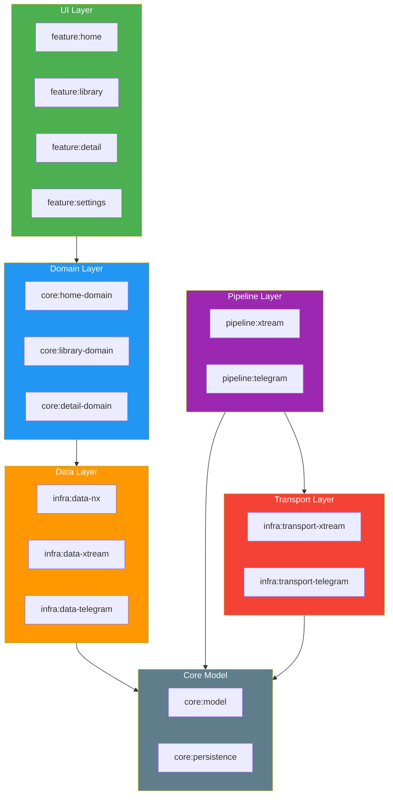

# Layer Boundaries

**Generated on 2026-02-15 — DO NOT EDIT MANUALLY**

> Regenerate with: `./gradlew :tools:doc-generator:run --args="--diagrams"`

## Architecture Layers

## Forbidden Dependencies

| Layer | MUST NOT Import From |
|-------|---------------------|
| Pipeline | Persistence, Data, Playback, UI |
| Transport | Pipeline, Data, Playback, UI, Persistence |
| Data | Pipeline DTOs (TelegramMediaItem, XtreamVodItem) |
| Playback | Pipeline DTOs |
| UI/Feature | Obx*, Pipeline DTOs, Transport |
