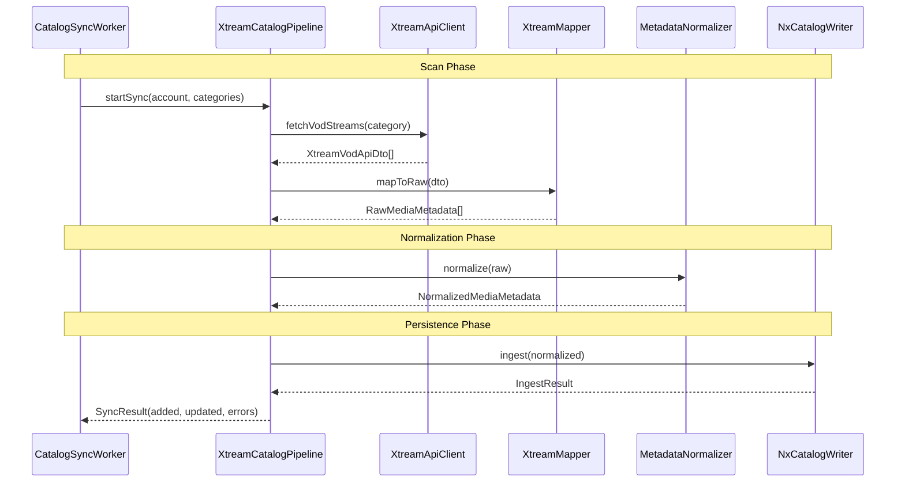
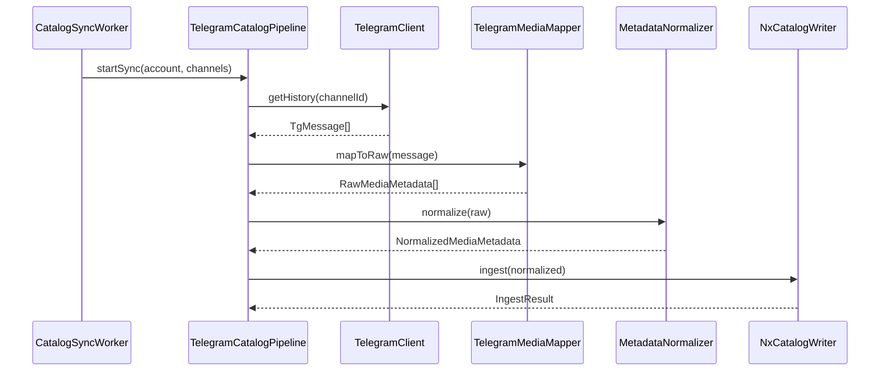

# Pipeline Flow

**Generated on 2026-02-15 — DO NOT EDIT MANUALLY**

> Regenerate with: `./gradlew :tools:doc-generator:run --args="--diagrams"`

## Xtream Catalog Sync Flow

## Telegram Pipeline Flow

