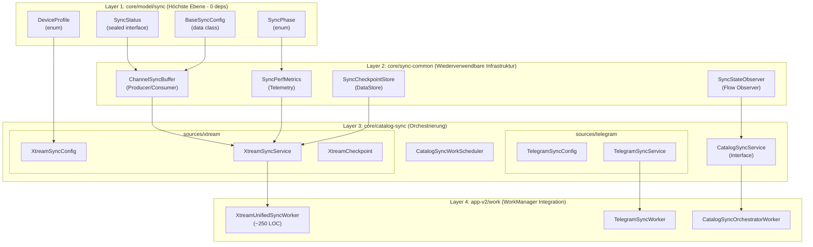

# 🚀 Xtream Sync System - Complete Refactoring Plan

> **Version:** 1.1  
> **Created:** 2026-02-05  
> **Updated:** 2026-02-05  
> **Status:** IN_PROGRESS (Phase 2 Complete)  
> **Goal:** TiviMate-Style Unified Sync mit maximaler Wiederverwendbarkeit

---

## 📊 Architecture Diagram



---

## 📈 Metrics Targets

| Metric | Current | Target | Improvement |
|--------|---------|--------|-------------|
| Sync Methods (Xtream) | 6 | **1** | -83% |
| XtreamCatalogScanWorker LOC | 1,337 | **~250** | -81% |
| DefaultCatalogSyncService LOC | ~800 | **~400** | -50% |
| Enhanced Handler Files | 8 | **0** | -100% |
| Total Affected Files | 27 | **~12** | -56% |
| Code Duplication | ~940 LOC | **~0** | -100% |

---

## 🔧 Implementation Phases

### Phase 0: Preparation & Tooling ✨

- [ ] **0.1** Create feature branch: `feature/xtream-sync-unified`
- [ ] **0.2** Set up Detekt custom rules for layer boundary enforcement
- [ ] **0.3** Configure test coverage baseline (JaCoCo)
- [ ] **0.4** Create GitHub Issue for tracking: "Xtream Sync Unification"
- [ ] **0.5** Back up current sync metrics (performance baseline)

**Quality Gate:** Branch created, tooling configured

---

### Phase 1: Layer 1 - core/model/sync (Foundation Models) ✅ COMPLETE

> **Goal:** Source-agnostic models that ALL pipelines can use

- [x] **1.1** Create package: `core/model/src/.../model/sync/`
- [x] **1.2** Create `SyncPhase.kt`
  ```kotlin
  enum class SyncPhase {
      INITIALIZING,
      LIVE_CHANNELS,
      VOD_MOVIES,
      SERIES_INDEX,
      SERIES_EPISODES,
      FINALIZING,
  }
  ```
- [x] **1.3** Create `DeviceProfile.kt`
  ```kotlin
  enum class DeviceProfile {
      AUTO,           // Detect at runtime
      PHONE_HIGH_RAM, // Buffer=1000, Consumers=3
      PHONE_LOW_RAM,  // Buffer=500, Consumers=2
      FIRETV_STICK,   // Buffer=500, Consumers=2
      SHIELD_TV,      // Buffer=2000, Consumers=4
      CHROMECAST_GTV, // Buffer=700, Consumers=2
  }
  ```
- [x] **1.4** Create `BaseSyncConfig.kt`
  ```kotlin
  interface BaseSyncConfig {
      val accountKey: String
      val deviceProfile: DeviceProfile
      val forceFullSync: Boolean
  }
  ```
- [x] **1.5** Create `SyncStatus.kt` (Source-Agnostic Version)
  ```kotlin
  sealed interface SyncStatus {
      data class Started(val source: String) : SyncStatus
      data class InProgress(...) : SyncStatus
      data class Completed(...) : SyncStatus
      data class Cancelled(...) : SyncStatus
      data class Error(...) : SyncStatus
      data class CheckpointReached(
          val source: String,
          val checkpointId: String,
          val metadata: Map<String, Any>,
      ) : SyncStatus
  }
  ```
- [x] **1.6** Run `./gradlew :core:model:compileDebugKotlin` - must pass
- [ ] **1.7** Add unit tests for enums and data classes (DEFERRED)

**Quality Gate:** `core:model` compiles, tests green, 0 dependencies added

---

### Phase 2: Layer 2 - core/sync-common (Reusable Infrastructure) ✅ COMPLETE

> **Goal:** Shared infrastructure usable by Xtream, Telegram, IO, Audiobook

- [x] **2.1** Create new Gradle module: `core/sync-common`
  - [x] Add `core/sync-common/build.gradle.kts`
  - [x] Add to `settings.gradle.kts`
  - [x] Dependencies: `core:model`, `infra:logging`
- [x] **2.2** Migrate `ChannelSyncBuffer.kt` → `core/sync-common/buffer/`
  - [x] Copy file (don't modify original yet)
  - [x] Update package declaration
  - [x] Add generics for type safety: `ChannelSyncBuffer<T>`
  - [x] Add KDoc documentation
- [x] **2.3** Migrate `SyncPerfMetrics.kt` → `core/sync-common/metrics/`
  - [x] Make source-agnostic (remove Xtream-specific fields)
  - [x] Add extensible `tags: Map<String, String>` for source-specific data
- [x] **2.4** Migrate `SyncCheckpointStore.kt` → `core/sync-common/checkpoint/`
  - [x] Generalize key format: `{source}:{accountKey}:{checkpointType}`
  - [x] Add typed checkpoint interface
- [x] **2.5** ~~Migrate `SyncStateObserver.kt`~~ (NOT NEEDED - covered by SyncPerfMetrics flows)
- [x] **2.6** Create `DeviceProfileDetector.kt`
  ```kotlin
  object DeviceProfileDetector {
      fun detect(context: Context): DeviceProfile
  }
  ```
- [x] **2.7** Create DI Module: `SyncCommonModule.kt`
- [x] **2.8** Run `./gradlew :core:sync-common:compileDebugKotlin` - ✅ PASS
- [ ] **2.9** Add unit tests for all migrated components (DEFERRED)
- [ ] **2.10** Run Detekt: no layer violations allowed

**Quality Gate:** ✅ New module compiles, no catalog-sync imports

---

### Phase 3: Layer 3 - Xtream Sync Service (Unified Implementation) 🎯

> **Goal:** ONE sync method to replace all 6, TiviMate-style

- [ ] **3.1** Create `core/catalog-sync/sources/xtream/` package structure
- [ ] **3.2** Create `XtreamSyncConfig.kt`
  ```kotlin
  data class XtreamSyncConfig(
      // Content Selection
      val syncVod: Boolean = true,
      val syncSeries: Boolean = true,
      val syncLive: Boolean = true,
      val syncEpisodes: Boolean = false,
      
      // Category Selection (UI-driven)
      val vodCategoryIds: Set<String> = emptySet(),
      val seriesCategoryIds: Set<String> = emptySet(),
      val liveCategoryIds: Set<String> = emptySet(),
      
      // Incremental Control
      override val accountKey: String,
      override val forceFullSync: Boolean = false,
      override val deviceProfile: DeviceProfile = DeviceProfile.AUTO,
      
      // Advanced (auto-optimized)
      val bufferSize: Int? = null,  // null = auto from profile
      val consumerCount: Int? = null,
  ) : BaseSyncConfig {
      companion object {
          fun fullSync(accountKey: String) = ...
          fun incremental(accountKey: String) = ...
          fun withCategories(...) = ...
      }
  }
  ```
- [ ] **3.3** Create `XtreamSyncService.kt` (Interface)
  ```kotlin
  interface XtreamSyncService {
      fun sync(config: XtreamSyncConfig): Flow<SyncStatus>
      suspend fun loadCategories(): XtreamCategories
      fun cancel()
  }
  ```
- [ ] **3.4** Create `DefaultXtreamSyncService.kt` (Implementation)
  - [ ] Inject: `ChannelSyncBuffer`, `SyncCheckpointStore`, `IncrementalSyncDecider`
  - [ ] Single `sync()` method using Channel-based architecture
  - [ ] Internal device profile detection
  - [ ] Incremental sync logic integrated
  - [ ] Progress emission via `SyncStatus` Flow
  - [ ] Target: ~400 LOC max
- [ ] **3.5** Create Handler Classes (SRP)
  - [ ] `XtreamSyncPhaseHandler.kt` - Phase orchestration (~100 LOC)
  - [ ] `XtreamProgressEmitter.kt` - Status emission (~50 LOC)
  - [ ] `XtreamCategoryFilter.kt` - Category filtering (~60 LOC)
- [ ] **3.6** Create `XtreamSyncCheckpoint.kt` (Source-specific)
- [ ] **3.7** Update DI: `XtreamSyncModule.kt`
- [ ] **3.8** Run `./gradlew :core:catalog-sync:compileDebugKotlin` - must pass
- [ ] **3.9** Unit tests for new service
- [ ] **3.10** Integration test: Full sync flow

**Quality Gate:** New service compiles, unit tests green, no enhanced/* imports

---

### Phase 4: Layer 4 - Unified Worker (WorkManager) 👷

> **Goal:** Replace 1337 LOC monster with ~250 LOC clean worker

- [ ] **4.1** Create `app-v2/work/v2/XtreamUnifiedSyncWorker.kt`
  ```kotlin
  @HiltWorker
  class XtreamUnifiedSyncWorker @AssistedInject constructor(
      @Assisted context: Context,
      @Assisted params: WorkerParameters,
      private val syncService: XtreamSyncService,
      private val checkpointStore: SyncCheckpointStore,
  ) : CoroutineWorker(context, params) {
      
      override suspend fun doWork(): Result {
          val config = XtreamSyncConfig.fromInputData(inputData)
          
          return syncService.sync(config)
              .onEach { status -> setProgress(status.toWorkData()) }
              .catch { e -> emit(SyncStatus.Error(...)) }
              .lastOrNull()
              .toWorkerResult()
      }
  }
  ```
- [ ] **4.2** Create `XtreamSyncInputData.kt` - Worker input serialization
- [ ] **4.3** Create `XtreamSyncProgressData.kt` - Progress reporting
- [ ] **4.4** Update `CatalogSyncWorkScheduler.kt` to use new worker
- [ ] **4.5** Run `./gradlew :app-v2:compileDebugKotlin` - must pass
- [ ] **4.6** Unit tests for worker
- [ ] **4.7** Manual test: Schedule sync via WorkManager

**Quality Gate:** Worker compiles, tests green, <300 LOC total

---

### Phase 5: Feature Flag & Parallel Running 🚦

> **Goal:** Safe rollout with fallback capability

- [ ] **5.1** Add feature flag: `ENABLE_UNIFIED_XTREAM_SYNC`
  - [ ] Add to `DebugSettings` screen
  - [ ] Default: `false` (old behavior)
- [ ] **5.2** Update `CatalogSyncWorkScheduler` to respect flag
  ```kotlin
  fun scheduleXtreamSync(config: XtreamSyncConfig) {
      if (featureFlags.unifiedXtreamSync) {
          enqueueUnifiedWorker(config)
      } else {
          enqueueLegacyWorker(config)
      }
  }
  ```
- [ ] **5.3** Add A/B comparison logging
  - [ ] Log sync duration for both paths
  - [ ] Log item counts
  - [ ] Compare memory usage
- [ ] **5.4** Integration test: Both paths produce same results
- [ ] **5.5** Performance benchmark: New vs Old
  - [ ] Target: New must be ≥ as fast as old `syncXtreamBuffered`

**Quality Gate:** Feature flag working, both paths functional

---

### Phase 6: Migration & Deprecation ⚠️

> **Goal:** Gradual migration of callers to new API

- [ ] **6.1** Mark old methods as `@Deprecated`
  ```kotlin
  @Deprecated(
      "Use XtreamSyncService.sync() instead",
      ReplaceWith("xtreamSyncService.sync(XtreamSyncConfig(...))"),
      level = DeprecationLevel.WARNING,
  )
  fun syncXtreamBuffered(...): Flow<SyncStatus>
  ```
- [ ] **6.2** Update all direct callers:
  - [ ] `XtreamCatalogScanWorker.kt` references
  - [ ] `CatalogSyncOrchestratorWorker.kt` references
  - [ ] ViewModel direct calls
- [ ] **6.3** Update UI category selection to provide `XtreamSyncConfig`
- [ ] **6.4** Remove feature flag → new path is default
- [ ] **6.5** Run full test suite

**Quality Gate:** No deprecation warnings in new code

---

### Phase 7: Cleanup - Delete Legacy Code 🗑️

> **Goal:** Remove all obsolete files

- [ ] **7.1** Delete `enhanced/` directory (8 files)
  - [ ] `EnhancedBatchRouter.kt`
  - [ ] `EnhancedSyncState.kt`
  - [ ] `XtreamEnhancedSyncOrchestrator.kt`
  - [ ] `XtreamEventHandler.kt`
  - [ ] `XtreamEventHandlerRegistry.kt`
  - [ ] `handlers/ItemDiscoveredHandler.kt`
  - [ ] `handlers/ScanCancelledHandler.kt`
  - [ ] `handlers/ScanCompletedHandler.kt`
  - [ ] `handlers/ScanErrorHandler.kt`
  - [ ] `handlers/ScanProgressHandler.kt`
  - [ ] `handlers/SeriesEpisodeHandler.kt`
  - [ ] `di/EnhancedSyncModule.kt`
- [ ] **7.2** Delete obsolete sync methods from `DefaultCatalogSyncService.kt`
  - [ ] `syncXtream()` (deprecated)
  - [ ] `syncXtreamEnhanced()`
  - [ ] `syncXtreamDelta()`
  - [ ] `syncXtreamIncremental()`
  - [ ] Keep only backwards-compat wrappers if needed
- [ ] **7.3** Delete `SyncBatchManager.kt` (obsolete)
- [ ] **7.4** Delete `SyncPhaseConfig.kt` (replaced by XtreamSyncConfig)
- [ ] **7.5** Delete old `XtreamCatalogScanWorker.kt` (1337 LOC monster)
- [ ] **7.6** Rename v2 files to final names
  - [ ] `XtreamUnifiedSyncWorker.kt` → `XtreamSyncWorker.kt`
- [ ] **7.7** Run `./gradlew clean assembleDebug` - must pass
- [ ] **7.8** Run full test suite

**Quality Gate:** Build green, no dead code references

---

### Phase 8: Final Verification & Documentation 📝

- [ ] **8.1** Performance Verification
  - [ ] Sync time: ≤ previous best (`syncXtreamBuffered`)
  - [ ] Memory usage: ≤ previous
  - [ ] Item counts: Exact match
- [ ] **8.2** Update Architecture Documentation
  - [ ] Update `AGENTS.md` Section 4.8 with new structure
  - [ ] Update `catalog-sync.instructions.md`
  - [ ] Update `CATALOG_SYNC_WORKERS_CONTRACT_V2.md`
- [ ] **8.3** Update CHANGELOG.md
- [ ] **8.4** Remove this plan from ROADMAP.md (completed)
- [ ] **8.5** Code Review Checklist
  - [ ] No `com.chris.m3usuite` references
  - [ ] All new code follows GLOSSARY naming
  - [ ] Layer boundaries respected
  - [ ] KDoc on all public APIs
- [ ] **8.6** Create PR: `feature/xtream-sync-unified → architecture/v2-bootstrap`

**Quality Gate:** PR approved, all checks green

---

## 📁 File Inventory: Before → After

### Files to CREATE (New)

| File | Location | LOC (est.) |
|------|----------|------------|
| `SyncPhase.kt` | `core/model/sync/` | ~20 |
| `DeviceProfile.kt` | `core/model/sync/` | ~30 |
| `BaseSyncConfig.kt` | `core/model/sync/` | ~15 |
| `SyncStatus.kt` | `core/model/sync/` | ~80 |
| `build.gradle.kts` | `core/sync-common/` | ~40 |
| `ChannelSyncBuffer.kt` | `core/sync-common/buffer/` | ~150 |
| `SyncPerfMetrics.kt` | `core/sync-common/metrics/` | ~80 |
| `SyncCheckpointStore.kt` | `core/sync-common/checkpoint/` | ~180 |
| `DeviceProfileDetector.kt` | `core/sync-common/device/` | ~60 |
| `SyncCommonModule.kt` | `core/sync-common/di/` | ~40 |
| `XtreamSyncConfig.kt` | `core/catalog-sync/sources/xtream/` | ~100 |
| `XtreamSyncService.kt` | `core/catalog-sync/sources/xtream/` | ~50 |
| `DefaultXtreamSyncService.kt` | `core/catalog-sync/sources/xtream/` | ~400 |
| `XtreamSyncPhaseHandler.kt` | `core/catalog-sync/sources/xtream/` | ~100 |
| `XtreamProgressEmitter.kt` | `core/catalog-sync/sources/xtream/` | ~50 |
| `XtreamSyncModule.kt` | `core/catalog-sync/sources/xtream/di/` | ~60 |
| `XtreamUnifiedSyncWorker.kt` | `app-v2/work/` | ~250 |
| `XtreamSyncInputData.kt` | `app-v2/work/` | ~60 |

**Total NEW:** ~1,765 LOC

### Files to DELETE (Legacy)

| File | Location | LOC |
|------|----------|-----|
| `XtreamCatalogScanWorker.kt` | `app-v2/work/` | 1,337 |
| `EnhancedBatchRouter.kt` | `core/catalog-sync/enhanced/` | ~100 |
| `EnhancedSyncState.kt` | `core/catalog-sync/enhanced/` | ~50 |
| `XtreamEnhancedSyncOrchestrator.kt` | `core/catalog-sync/enhanced/` | ~200 |
| `XtreamEventHandler.kt` | `core/catalog-sync/enhanced/` | ~40 |
| `XtreamEventHandlerRegistry.kt` | `core/catalog-sync/enhanced/` | ~60 |
| `ItemDiscoveredHandler.kt` | `core/catalog-sync/enhanced/handlers/` | ~80 |
| `ScanCancelledHandler.kt` | `core/catalog-sync/enhanced/handlers/` | ~30 |
| `ScanCompletedHandler.kt` | `core/catalog-sync/enhanced/handlers/` | ~40 |
| `ScanErrorHandler.kt` | `core/catalog-sync/enhanced/handlers/` | ~30 |
| `ScanProgressHandler.kt` | `core/catalog-sync/enhanced/handlers/` | ~40 |
| `SeriesEpisodeHandler.kt` | `core/catalog-sync/enhanced/handlers/` | ~50 |
| `EnhancedSyncModule.kt` | `core/catalog-sync/enhanced/di/` | ~40 |
| `SyncBatchManager.kt` | `core/catalog-sync/` | ~120 |
| `SyncPhaseConfig.kt` | `core/catalog-sync/` | ~60 |
| Old methods in `DefaultCatalogSyncService.kt` | - | ~400 |

**Total DELETE:** ~2,677 LOC

### Net Result

| Metric | Value |
|--------|-------|
| New Code | +1,765 LOC |
| Deleted Code | -2,677 LOC |
| **Net Change** | **-912 LOC (-34%)** |
| Sync Methods | 6 → 1 |
| Worker LOC | 1,337 → 250 |

---

## 🛠️ External Tools Integration

### Quality Assurance Tools

| Tool | Purpose | Phase |
|------|---------|-------|
| **Detekt** | Layer boundary enforcement | Phase 0, continuous |
| **JaCoCo** | Test coverage (target: 80%) | Phase 0, continuous |
| **Android Lint** | Memory/performance checks | Phase 5 |
| **Gradle Build Scan** | Build performance analysis | Phase 5, 7 |
| **LeakCanary** | Memory leak detection | Phase 5 |

### Architecture Validation

```bash
# Layer Boundary Check (run after each phase)
./gradlew detekt

# Forbidden Import Check
grep -rn "import.*enhanced\." core/catalog-sync/sources/ | wc -l
# Must be 0

# Dead Code Check
grep -rn "syncXtreamEnhanced\|syncXtreamDelta" app-v2/
# After Phase 7: Must be 0
```

---

## 🎯 Success Criteria

- [ ] **Performance:** Sync time ≤ `syncXtreamBuffered` baseline
- [ ] **Memory:** Peak usage ≤ previous (no regressions)
- [ ] **Correctness:** Item counts exact match
- [ ] **Code Quality:** Detekt/Lint clean
- [ ] **Test Coverage:** ≥80% for new code
- [ ] **LOC Reduction:** ≥30% net reduction achieved
- [ ] **Single Method:** Only ONE Xtream sync method exists
- [ ] **Reusability:** Telegram pipeline can use `core/sync-common`

---

## 📅 Estimated Timeline

| Phase | Duration | Cumulative |
|-------|----------|------------|
| Phase 0 (Prep) | 0.5 days | 0.5 days |
| Phase 1 (Models) | 1 day | 1.5 days |
| Phase 2 (Infrastructure) | 1.5 days | 3 days |
| Phase 3 (Service) | 2 days | 5 days |
| Phase 4 (Worker) | 1 day | 6 days |
| Phase 5 (Feature Flag) | 1 day | 7 days |
| Phase 6 (Migration) | 1 day | 8 days |
| Phase 7 (Cleanup) | 0.5 days | 8.5 days |
| Phase 8 (Docs) | 0.5 days | **9 days** |

**Total Estimated:** 9 working days

---

## 🔗 References

- **TiviMate Architecture:** Single `syncPlaylist(config)` pattern
- **AGENTS.md Section 4.8:** Global Sync Orchestration SSOT
- **CATALOG_SYNC_WORKERS_CONTRACT_V2.md:** Worker rules
- **Channel-based architecture:** `ChannelSyncBuffer.kt` (existing)
- **Legacy Worker:** `XtreamCatalogScanWorker.kt` (1337 LOC reference)

---

*This plan follows AGENTS.md Section 11 Pre-/Post-Change Checklists*
