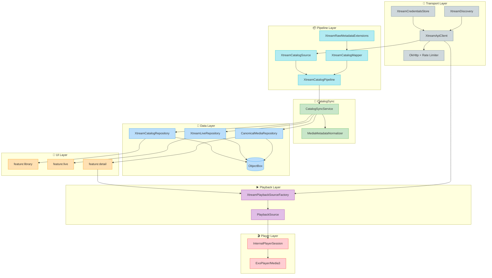
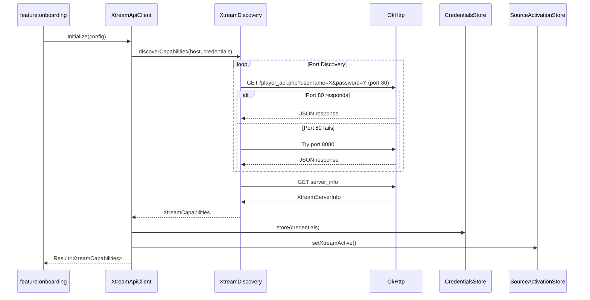
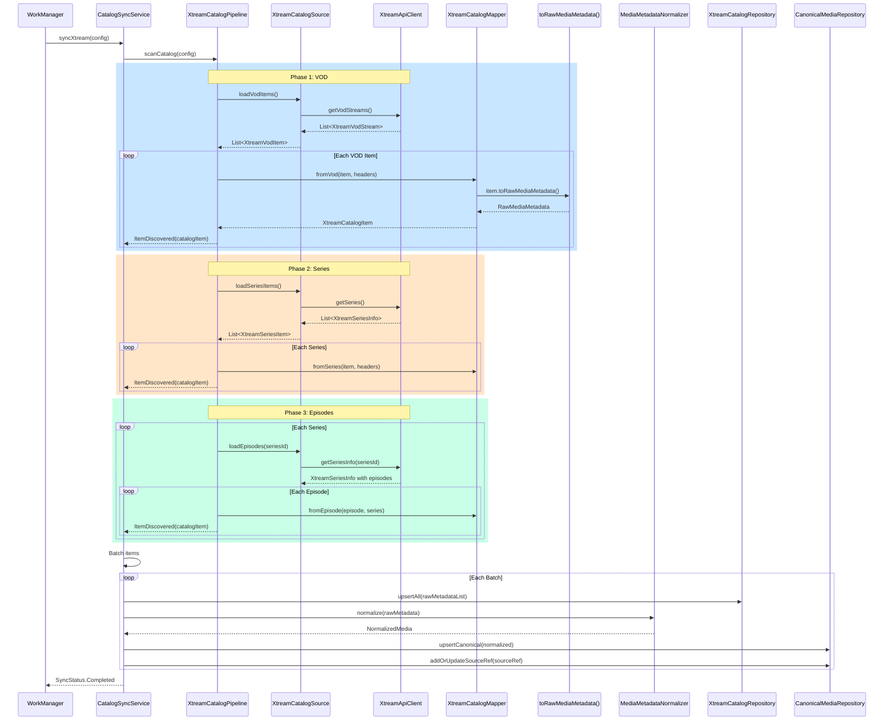
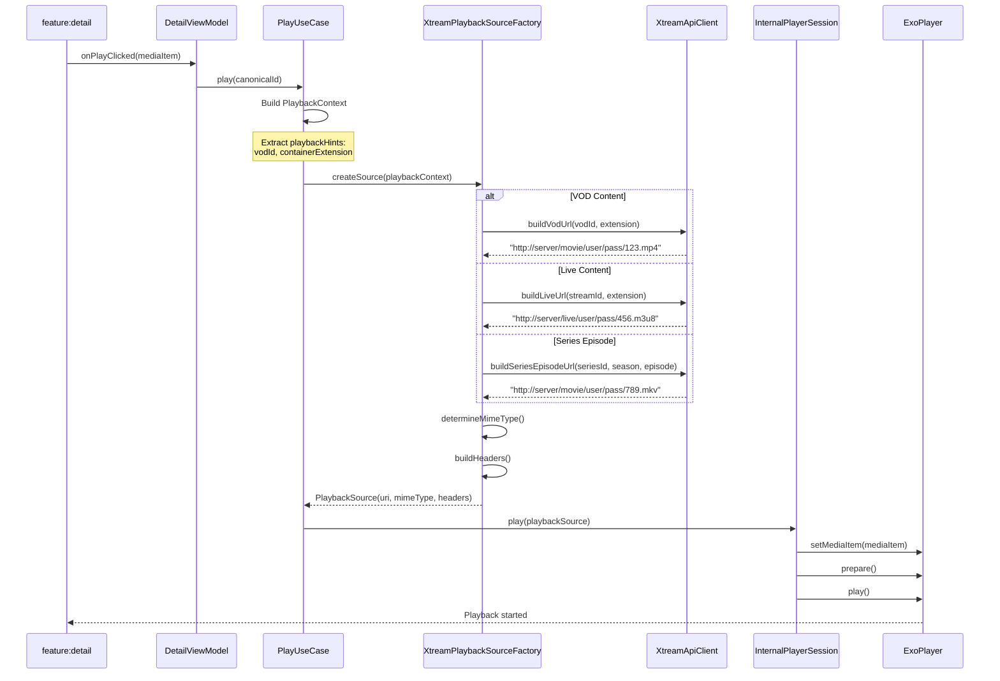

# Xtream End-to-End Data Flow

> **Branch:** `architecture/v2-bootstrap`
> **Generated:** 2024-12-30
> **Scope:** Complete data flow for Xtream Codes API from connection through playback

---

## Table of Contents

1. [Overview](#overview)
2. [Architecture Diagram](#architecture-diagram)
3. [Flow 1: Connection & Discovery](#flow-1-connection--discovery)
4. [Flow 2: Catalog Sync](#flow-2-catalog-sync)
5. [Flow 3: Playback](#flow-3-playback)
6. [Key Components Reference](#key-components-reference)
7. [Error Handling](#error-handling)
8. [Related Contracts](#related-contracts)

---

## Overview

The Xtream data flow follows the v2 layer architecture:

```text
Transport → Pipeline → CatalogSync → Data → Domain → UI
    ↓                                           ↑
    └───────────────── Playback ────────────────┘
```

**Three Main Flows:**

1. **Connection & Discovery** – Authenticate, detect capabilities, resolve ports
2. **Catalog Sync** – Fetch VOD/Series/Live, transform to `RawMediaMetadata`, persist
3. **Playback** – Build stream URL, create Media3 source, play

---

## Architecture Diagram



---

## Flow 1: Connection & Discovery

### Sequence Diagram



### Code References

**Entry Point:**  
[XtreamApiClient.kt](../../infra/transport-xtream/src/main/java/com/fishit/player/infra/transport/xtream/XtreamApiClient.kt)

```kotlin
interface XtreamApiClient {
    val authState: StateFlow<XtreamAuthState>
    val connectionState: StateFlow<XtreamConnectionState>
    val capabilities: XtreamCapabilities?
    
    suspend fun initialize(
        config: XtreamApiConfig,
        forceDiscovery: Boolean = false,
    ): Result<XtreamCapabilities>
}
```

**Discovery Logic:**  
[XtreamDiscovery.kt](../../infra/transport-xtream/src/main/java/com/fishit/player/infra/transport/xtream/XtreamDiscovery.kt)

- Port resolution: 80 → 8080 → 8000 → 443
- Endpoint alias detection (`vod` vs `movie` vs `movies`)
- Feature detection (EPG, categories, etc.)

**Credential Storage:**  
[EncryptedXtreamCredentialsStore.kt](../../infra/transport-xtream/src/main/java/com/fishit/player/infra/transport/xtream/EncryptedXtreamCredentialsStore.kt)

- Uses Android EncryptedSharedPreferences
- Never exposes credentials in logs

### Key Types

| Type | Location | Description |
|------|----------|-------------|
| `XtreamApiConfig` | `infra:transport-xtream` | Connection configuration |
| `XtreamCapabilities` | `infra:transport-xtream` | Discovered panel features |
| `XtreamServerInfo` | `infra:transport-xtream` | Panel server info response |
| `XtreamAuthState` | `infra:transport-xtream` | Auth state machine |

---

## Flow 2: Catalog Sync

### Sequence Diagram



### Code References

**Pipeline Entry:**  
[XtreamCatalogPipelineImpl.kt](../../pipeline/xtream/src/main/java/com/fishit/player/pipeline/xtream/catalog/XtreamCatalogPipelineImpl.kt)

```kotlin
class XtreamCatalogPipelineImpl @Inject constructor(
    private val source: XtreamCatalogSource,
    private val mapper: XtreamCatalogMapper,
) : XtreamCatalogPipeline {

    override fun scanCatalog(config: XtreamCatalogConfig): Flow<XtreamCatalogEvent> = channelFlow {
        // Phase 1: VOD
        if (config.includeVod) {
            val vodItems = source.loadVodItems()
            for (item in vodItems) {
                val catalogItem = mapper.fromVod(item, headers)
                trySend(XtreamCatalogEvent.ItemDiscovered(catalogItem))
            }
        }
        // Phase 2: Series...
        // Phase 3: Episodes...
        // Phase 4: Live...
    }
}
```

**DTO → RawMediaMetadata Mapping:**  
[XtreamRawMetadataExtensions.kt](../../pipeline/xtream/src/main/java/com/fishit/player/pipeline/xtream/mapper/XtreamRawMetadataExtensions.kt)

```kotlin
fun XtreamVodItem.toRawMediaMetadata(): RawMediaMetadata = RawMediaMetadata(
    sourceId = "xtream:vod:$vodId",
    sourceType = SourceType.XTREAM,
    mediaType = MediaType.MOVIE,
    title = name,
    originalTitle = name,
    externalIds = ExternalIds(
        tmdb = tmdbId?.let { TmdbRef(TmdbMediaType.MOVIE, it) },
    ),
    poster = coverUrl?.let { ImageRef.Url(it) },
    releaseYear = year,
    runtime = parseDurationToMs(duration),
    plot = plot,
    playbackHints = mapOf(
        PlaybackHintKeys.VOD_ID to vodId.toString(),
        PlaybackHintKeys.CONTAINER_EXTENSION to containerExtension,
    ),
)
```

**Sync Orchestration:**  
[DefaultCatalogSyncService.kt](../../core/catalog-sync/src/main/java/com/fishit/player/core/catalogsync/DefaultCatalogSyncService.kt)

```kotlin
@Singleton
class DefaultCatalogSyncService @Inject constructor(
    private val xtreamPipeline: XtreamCatalogPipeline,
    private val xtreamCatalogRepository: XtreamCatalogRepository,
    private val normalizer: MediaMetadataNormalizer,
    private val canonicalMediaRepository: CanonicalMediaRepository,
) : CatalogSyncService {

    override fun syncXtream(syncConfig: SyncConfig): Flow<SyncStatus> = flow {
        xtreamPipeline.scanCatalog(config).collect { event ->
            when (event) {
                is XtreamCatalogEvent.ItemDiscovered -> {
                    batch.add(event.item.raw)
                    if (batch.size >= syncConfig.batchSize) {
                        persistXtreamBatch(batch)
                    }
                }
            }
        }
    }
    
    private suspend fun persistXtreamBatch(batch: List<RawMediaMetadata>) {
        // 1. Store raw in pipeline-specific repo
        xtreamCatalogRepository.upsertAll(batch)
        
        // 2. Normalize and unify
        batch.forEach { raw ->
            val normalized = normalizer.normalize(raw)
            canonicalMediaRepository.upsertCanonical(normalized)
            canonicalMediaRepository.addOrUpdateSourceRef(
                MediaSourceRef(
                    canonicalId = normalized.canonicalId,
                    pipelineItemId = raw.sourceId.asPipelineItemId(),
                    sourceType = raw.sourceType,
                )
            )
        }
    }
}
```

**Repository Persistence:**  
[ObxXtreamCatalogRepository.kt](../../infra/data-xtream/src/main/java/com/fishit/player/infra/data/xtream/ObxXtreamCatalogRepository.kt)

```kotlin
@Singleton
class ObxXtreamCatalogRepository @Inject constructor(
    private val boxStore: BoxStore
) : XtreamCatalogRepository {
    
    override suspend fun upsertAll(items: List<RawMediaMetadata>) = withContext(Dispatchers.IO) {
        boxStore.runInTx {
            items.forEach { raw ->
                when (raw.mediaType) {
                    MediaType.MOVIE -> upsertVod(raw)
                    MediaType.SERIES -> upsertSeries(raw)
                    MediaType.EPISODE -> upsertEpisode(raw)
                    else -> { /* ignore */ }
                }
            }
        }
    }
    
    override fun observeVod(categoryId: String?): Flow<List<RawMediaMetadata>> {
        val query = vodBox.query().order(ObxVod_.nameLower).build()
        return query.asFlow().map { entities -> entities.map { it.toRawMediaMetadata() } }
    }
}
```

### Key Types

| Type | Location | Description |
|------|----------|-------------|
| `XtreamCatalogConfig` | `pipeline:xtream` | Scan configuration |
| `XtreamCatalogEvent` | `pipeline:xtream` | Pipeline events |
| `XtreamVodItem` | `pipeline:xtream` | Internal VOD DTO |
| `XtreamSeriesItem` | `pipeline:xtream` | Internal series DTO |
| `RawMediaMetadata` | `core:model` | Canonical raw output |
| `SyncStatus` | `core:catalog-sync` | Sync progress events |

---

## Flow 3: Playback

### Sequence Diagram



### Code References

**PlaybackSourceFactory:**  
[XtreamPlaybackSourceFactoryImpl.kt](../../playback/xtream/src/main/java/com/fishit/player/playback/xtream/XtreamPlaybackSourceFactoryImpl.kt)

```kotlin
@Singleton
class XtreamPlaybackSourceFactoryImpl @Inject constructor(
    private val xtreamApiClient: XtreamApiClient
) : PlaybackSourceFactory {

    override fun supports(sourceType: SourceType): Boolean {
        return sourceType == SourceType.XTREAM
    }

    override suspend fun createSource(context: PlaybackContext): PlaybackSource {
        // Determine content type from extras
        val contentType = context.extras[EXTRA_CONTENT_TYPE] ?: inferContentType(context)
        
        val url = when (contentType) {
            CONTENT_TYPE_VOD -> buildVodUrl(context)
            CONTENT_TYPE_LIVE -> buildLiveUrl(context)
            CONTENT_TYPE_SERIES -> buildSeriesEpisodeUrl(context)
            else -> throw PlaybackSourceException("Unknown content type")
        }
        
        return PlaybackSource(
            uri = url,
            mimeType = determineMimeType(context),
            headers = buildHeaders(context),
            dataSourceType = DataSourceType.DEFAULT
        )
    }
    
    private suspend fun buildVodUrl(context: PlaybackContext): String {
        val vodId = context.extras[PlaybackHintKeys.VOD_ID]
            ?: throw PlaybackSourceException("Missing VOD ID")
        val extension = context.extras[PlaybackHintKeys.CONTAINER_EXTENSION] ?: "mp4"
        return xtreamApiClient.buildVodUrl(vodId.toInt(), extension)
    }
}
```

**URL Building (Transport):**  
[XtreamUrlBuilder.kt](../../infra/transport-xtream/src/main/java/com/fishit/player/infra/transport/xtream/XtreamUrlBuilder.kt)

```kotlin
// URL patterns:
// Live:    http://{host}/live/{user}/{pass}/{streamId}.{ext}
// VOD:     http://{host}/movie/{user}/{pass}/{vodId}.{ext}
// Series:  http://{host}/movie/{user}/{pass}/{episodeId}.{ext}
//          (Episodes use VOD/movie path for file-based playback)
```

**PlaybackContext Construction:**

```kotlin
// From RawMediaMetadata.playbackHints
val playbackContext = PlaybackContext(
    canonicalId = raw.sourceId,
    sourceType = SourceType.XTREAM,
    title = raw.title,
    uri = null,  // Let factory build URL
    extras = mapOf(
        EXTRA_CONTENT_TYPE to CONTENT_TYPE_VOD,
        EXTRA_VOD_ID to raw.playbackHints[PlaybackHintKeys.VOD_ID],
        EXTRA_CONTAINER_EXT to raw.playbackHints[PlaybackHintKeys.CONTAINER_EXTENSION],
    )
)
```

### Key Types

| Type | Location | Description |
|------|----------|-------------|
| `PlaybackContext` | `core:player-model` | What to play |
| `PlaybackSource` | `playback:domain` | Ready-to-play source |
| `PlaybackSourceFactory` | `playback:domain` | Factory interface |
| `DataSourceType` | `playback:domain` | Media3 source type |
| `PlaybackHintKeys` | `core:model` | Standard hint keys |

---

## Key Components Reference

### Transport Layer (`infra:transport-xtream`)

| Component | Responsibility |
|-----------|----------------|
| `XtreamApiClient` | Main API client interface |
| `DefaultXtreamApiClient` | Implementation with caching |
| `XtreamDiscovery` | Port & capability detection |
| `XtreamCredentialsStore` | Encrypted credential storage |
| `XtreamUrlBuilder` | Stream URL construction |
| `XtreamParallelism` | Rate limiting per host |
| `XtreamHttpHeaders` | Auth header building |

### Pipeline Layer (`pipeline:xtream`)

| Component | Responsibility |
|-----------|----------------|
| `XtreamCatalogPipeline` | Catalog scan contract |
| `XtreamCatalogPipelineImpl` | Scan implementation |
| `XtreamCatalogSource` | Data source abstraction |
| `XtreamCatalogMapper` | DTO → CatalogItem |
| `XtreamRawMetadataExtensions` | DTO → RawMediaMetadata |
| `XtreamVodItem` | Internal VOD model |
| `XtreamSeriesItem` | Internal series model |
| `XtreamChannel` | Internal live channel model |

### Data Layer (`infra:data-xtream`)

| Component | Responsibility |
|-----------|----------------|
| `XtreamCatalogRepository` | VOD/Series persistence |
| `XtreamLiveRepository` | Live channel persistence |
| `ObxXtreamCatalogRepository` | ObjectBox implementation |
| `LibraryContentRepositoryAdapter` | Feature adapter |
| `LiveContentRepositoryAdapter` | Feature adapter |

### Playback Layer (`playback:xtream`)

| Component | Responsibility |
|-----------|----------------|
| `XtreamPlaybackSourceFactory` | Creates playback sources |
| `XtreamPlaybackSourceFactoryImpl` | Factory implementation |

---

## Error Handling

### Connection Errors

| Error | Recovery |
|-------|----------|
| Network unreachable | Retry with exponential backoff |
| Invalid credentials | Clear credentials, prompt re-auth |
| Panel blocked | Switch port, wait before retry |
| SSL error | Try HTTP fallback (if allowed) |

### Sync Errors

| Error | Recovery |
|-------|----------|
| API timeout | Checkpoint + resume |
| Partial response | Retry category |
| Rate limit | Pause + backoff |

### Playback Errors

| Error | Recovery |
|-------|----------|
| Stream unavailable | Try alternate format (m3u8 → ts) |
| Auth expired | Re-initialize client |
| Format unsupported | Fall back to FFmpeg decoder |

---

## Related Contracts

- [MEDIA_NORMALIZATION_CONTRACT.md](../../../contracts/MEDIA_NORMALIZATION_CONTRACT.md) – Normalization rules
- [XTREAM_SCAN_PREMIUM_CONTRACT_V1.md](../../../contracts/XTREAM_SCAN_PREMIUM_CONTRACT_V1.md) – Premium scan features
- [GLOSSARY_v2_naming_and_modules.md](../../../contracts/GLOSSARY_v2_naming_and_modules.md) – Naming conventions
- [MODULE_RESPONSIBILITY_MAP.md](MODULE_RESPONSIBILITY_MAP.md) – Module ownership
- [DEPENDENCY_GRAPH.md](DEPENDENCY_GRAPH.md) – Module dependencies

---

## File Index

| File | Layer | Purpose |
|------|-------|---------|
| [XtreamApiClient.kt](../../infra/transport-xtream/src/main/java/com/fishit/player/infra/transport/xtream/XtreamApiClient.kt) | Transport | API interface |
| [DefaultXtreamApiClient.kt](../../infra/transport-xtream/src/main/java/com/fishit/player/infra/transport/xtream/DefaultXtreamApiClient.kt) | Transport | Implementation |
| [XtreamDiscovery.kt](../../infra/transport-xtream/src/main/java/com/fishit/player/infra/transport/xtream/XtreamDiscovery.kt) | Transport | Discovery |
| [XtreamUrlBuilder.kt](../../infra/transport-xtream/src/main/java/com/fishit/player/infra/transport/xtream/XtreamUrlBuilder.kt) | Transport | URL building |
| [XtreamCatalogPipelineImpl.kt](../../pipeline/xtream/src/main/java/com/fishit/player/pipeline/xtream/catalog/XtreamCatalogPipelineImpl.kt) | Pipeline | Scan flow |
| [XtreamRawMetadataExtensions.kt](../../pipeline/xtream/src/main/java/com/fishit/player/pipeline/xtream/mapper/XtreamRawMetadataExtensions.kt) | Pipeline | Mapping |
| [DefaultCatalogSyncService.kt](../../core/catalog-sync/src/main/java/com/fishit/player/core/catalogsync/DefaultCatalogSyncService.kt) | Sync | Orchestration |
| [ObxXtreamCatalogRepository.kt](../../infra/data-xtream/src/main/java/com/fishit/player/infra/data/xtream/ObxXtreamCatalogRepository.kt) | Data | Persistence |
| [XtreamPlaybackSourceFactoryImpl.kt](../../playback/xtream/src/main/java/com/fishit/player/playback/xtream/XtreamPlaybackSourceFactoryImpl.kt) | Playback | Source factory |

---

*Generated from codebase analysis – Dec 2024*
