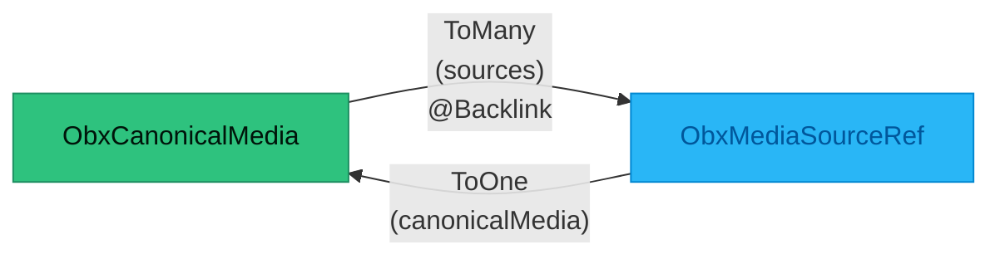
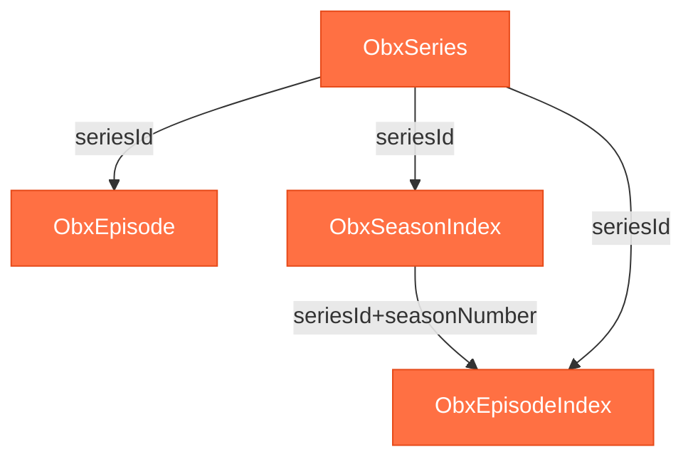
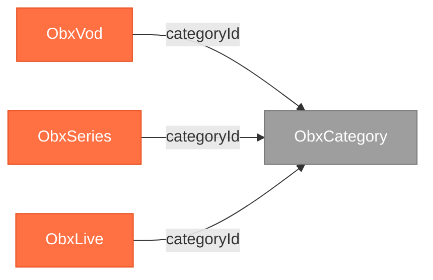
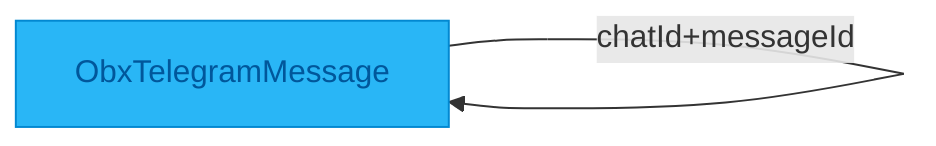
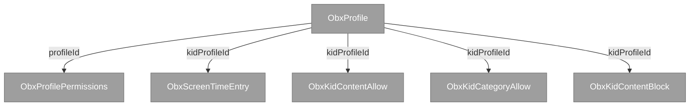

# Relation Dependency Graph

**Version:** 1.0  
**Generated:** 2026-01-08  
**Phase:** 2A - Final Synthesis

> **Purpose:** Visual mapping of all entity relationships in the ObjectBox data layer.
> Includes ObjectBox ToOne/ToMany relations and query-based manual joins.

---

## 🔗 ObjectBox Relations (Native)

### Canonical Media System



**Relation Details:**

| From Entity | Field | Type | To Entity | Cardinality | Annotation |
|-------------|-------|------|-----------|-------------|------------|
| ObxCanonicalMedia | sources | ToMany | ObxMediaSourceRef | 1:N | @Backlink(to = "canonicalMedia") |
| ObxMediaSourceRef | canonicalMedia | ToOne | ObxCanonicalMedia | N:1 | - |

**Usage Locations:**

1. **feature/detail/UnifiedDetailViewModel.kt**
   - Access all source variants for media item
   - Source selection logic for playback
   
2. **feature/detail/SourceSelection.kt**
   - Navigate from canonical to available sources
   - Filter by quality, format, availability
   
3. **infra/data-home/HomeContentRepositoryAdapter.kt**
   - Group multiple sources under single canonical media
   - Display source badges (Telegram, Xtream, Local)
   
4. **core/persistence/repository/ObxCanonicalMediaRepository.kt**
   - Link/unlink source references
   - Orphan cleanup (remove canonicals with no sources)

**Backlink Pattern:**

```kotlin
// Declaration in ObxCanonicalMedia
@Entity
data class ObxCanonicalMedia(
    @Id var id: Long = 0,
    // ... other fields
) {
    @Backlink(to = "canonicalMedia")
    lateinit var sources: ToMany<ObxMediaSourceRef>
}

// Declaration in ObxMediaSourceRef
@Entity
data class ObxMediaSourceRef(
    @Id var id: Long = 0,
    // ... other fields
) {
    lateinit var canonicalMedia: ToOne<ObxCanonicalMedia>
}
```

---

## 🔍 Manual Joins (Query-Based)

### Xtream Series Structure



**Join Patterns:**

1. **Series → Episodes**
   ```kotlin
   episodeBox.query(ObxEpisode_.seriesId.equal(seriesId)).build().find()
   ```
   - **Usage:** Load all episodes for a series
   - **Location:** infra/data-xtream/ObxXtreamCatalogRepository.kt
   - **Pattern:** Simple foreign key join

2. **Series → Season Index**
   ```kotlin
   seasonIndexBox.query(ObxSeasonIndex_.seriesId.equal(seriesId)).build().find()
   ```
   - **Usage:** Load season metadata (count, cover, air date)
   - **Location:** infra/data-xtream/ObxXtreamSeriesIndexRepository.kt
   - **Pattern:** Simple foreign key join

3. **Season → Episode Index (Composite Join)**
   ```kotlin
   episodeIndexBox.query(
       ObxEpisodeIndex_.seriesId.equal(seriesId)
           .and(ObxEpisodeIndex_.seasonNumber.equal(seasonNum))
   ).build().find()
   ```
   - **Usage:** Load episodes for specific season with playback hints
   - **Location:** infra/data-xtream/ObxXtreamSeriesIndexRepository.kt
   - **Pattern:** Composite key join

---

### Content Categorization



**Join Patterns:**

1. **VOD → Category**
   ```kotlin
   vodBox.query(ObxVod_.categoryId.equal(categoryId)).build().find()
   ```
   - **Usage:** Browse VOD by category
   - **Location:** infra/data-xtream/ObxXtreamCatalogRepository.kt

2. **Series → Category**
   ```kotlin
   seriesBox.query(ObxSeries_.categoryId.equal(categoryId)).build().find()
   ```
   - **Usage:** Browse series by category
   - **Location:** infra/data-xtream/ObxXtreamCatalogRepository.kt

3. **Live → Category**
   ```kotlin
   liveBox.query(ObxLive_.categoryId.equal(categoryId)).build().find()
   ```
   - **Usage:** Browse live channels by category
   - **Location:** infra/data-xtream/LiveContentRepositoryAdapter.kt

---

### Live TV & EPG


**Join Pattern:**

```kotlin
epgBox.query(ObxEpgNowNext_.streamId.equal(streamId)).build().findFirst()
// OR
epgBox.query(ObxEpgNowNext_.channelId.equal(channelId)).build().findFirst()
```

- **Usage:** Load EPG now/next data for live channel
- **Location:** infra/data-xtream/LiveContentRepositoryAdapter.kt
- **Cardinality:** 1:0..1 (one channel, optional EPG)

---

### Telegram Content



**Self-Join Pattern:**

```kotlin
messageBox.query(
    ObxTelegramMessage_.chatId.equal(chatId)
        .and(ObxTelegramMessage_.messageId.equal(messageId))
).build().findFirst()
```

- **Usage:** Find specific message in chat (no explicit relation)
- **Location:** infra/data-telegram/ObxTelegramContentRepository.kt
- **Pattern:** Composite unique lookup

---

### Resume & Watch History


**Join Pattern:**

```kotlin
resumeBox.query(
    ObxCanonicalResumeMark_.canonicalKey.equal(canonicalKey)
        .and(ObxCanonicalResumeMark_.profileId.equal(profileId))
).build().findFirst()
```

- **Usage:** Load resume position for canonical media + profile
- **Location:** core/persistence/repository/ObxCanonicalMediaRepository.kt
- **Cardinality:** N:1 (many resume marks per canonical, one per profile)

---

### Profile System



**Join Patterns:**

1. **Profile → Permissions**
   ```kotlin
   permissionsBox.query(ObxProfilePermissions_.profileId.equal(profileId)).build().findFirst()
   ```
   - **Usage:** Load permissions for profile
   - **Location:** core/persistence/repository/ObxProfileRepository.kt

2. **Profile → Screen Time**
   ```kotlin
   screenTimeBox.query(
       ObxScreenTimeEntry_.kidProfileId.equal(kidProfileId)
           .and(ObxScreenTimeEntry_.dayYyyymmdd.equal(day))
   ).build().findFirst()
   ```
   - **Usage:** Check daily screen time usage
   - **Location:** core/persistence/repository/ObxScreenTimeRepository.kt

3. **Profile → Kid Whitelist/Blacklist**
   ```kotlin
   allowBox.query(
       ObxKidContentAllow_.kidProfileId.equal(kidProfileId)
           .and(ObxKidContentAllow_.contentId.equal(contentId))
   ).build().findFirst()
   ```
   - **Usage:** Check if content allowed for kid profile
   - **Location:** Not yet implemented in scanned code

---

## 📊 Complete Relationship Overview

```mermaid
graph TB
    subgraph "Canonical System"
        CM[ObxCanonicalMedia]
        MSR[ObxMediaSourceRef]
        RM[ObxCanonicalResumeMark]
    end
    
    subgraph "Xtream VOD"
        VOD[ObxVod]
        CAT1[ObxCategory]
    end
    
    subgraph "Xtream Series"
        SER[ObxSeries]
        EPI[ObxEpisode]
        SI[ObxSeasonIndex]
        EI[ObxEpisodeIndex]
        CAT2[ObxCategory]
    end
    
    subgraph "Xtream Live"
        LIV[ObxLive]
        EPG[ObxEpgNowNext]
        CAT3[ObxCategory]
    end
    
    subgraph "Telegram"
        TG[ObxTelegramMessage]
    end
    
    subgraph "Profile System"
        PRO[ObxProfile]
        PERM[ObxProfilePermissions]
        SCR[ObxScreenTimeEntry]
        KCA[ObxKidContentAllow]
        KCAT[ObxKidCategoryAllow]
        KCB[ObxKidContentBlock]
    end
    
    CM -->|ToMany| MSR
    MSR -->|ToOne| CM
    RM -.->|canonicalKey| CM
    
    VOD -.->|categoryId| CAT1
    SER -.->|categoryId| CAT2
    SER -.->|seriesId| EPI
    SER -.->|seriesId| SI
    SER -.->|seriesId| EI
    SI -.->|seriesId+seasonNumber| EI
    LIV -.->|categoryId| CAT3
    LIV -.->|streamId| EPG
    
    PRO -.->|profileId| PERM
    PRO -.->|kidProfileId| SCR
    PRO -.->|kidProfileId| KCA
    PRO -.->|kidProfileId| KCAT
    PRO -.->|kidProfileId| KCB
    
    style CM fill:#2EC27E,stroke:#1E8F61,color:#00140A
    style MSR fill:#29B6F6,stroke:#0288D1,color:#01579B
    style RM fill:#2EC27E,stroke:#1E8F61,color:#00140A
    style VOD fill:#FF7043,stroke:#E64A19,color:#FFFFFF
    style SER fill:#FF7043,stroke:#E64A19,color:#FFFFFF
    style EPI fill:#FF7043,stroke:#E64A19,color:#FFFFFF
    style SI fill:#FF7043,stroke:#E64A19,color:#FFFFFF
    style EI fill:#FF7043,stroke:#E64A19,color:#FFFFFF
    style LIV fill:#FF7043,stroke:#E64A19,color:#FFFFFF
    style TG fill:#29B6F6,stroke:#0288D1,color:#01579B
    style PRO fill:#9E9E9E,stroke:#757575,color:#FFFFFF
```



**Legend:**
- **Solid arrows** (→): ObjectBox ToOne/ToMany relations
- **Dashed arrows** (-.->): Manual query-based joins
- **Colors**: Green=Canonical, Blue=Telegram, Orange=Xtream, Gray=Profile/Category

---

## 🔍 Join Pattern Analysis

### Simple Foreign Key Joins (1 field)

| From | Field | To | Usage |
|------|-------|-----|-------|
| ObxVod | categoryId | ObxCategory | Category filtering |
| ObxSeries | categoryId | ObxCategory | Category filtering |
| ObxLive | categoryId | ObxCategory | Category filtering |
| ObxSeries | seriesId | ObxEpisode | Load episodes |
| ObxSeries | seriesId | ObxSeasonIndex | Load seasons |
| ObxLive | streamId | ObxEpgNowNext | Load EPG |
| ObxProfile | profileId | ObxProfilePermissions | Load permissions |

**Performance:** Best - single indexed field lookup

### Composite Joins (2+ fields)

| From | Fields | To | Usage |
|------|--------|-----|-------|
| ObxEpisodeIndex | seriesId + seasonNumber | ObxSeasonIndex | Season episodes |
| ObxTelegramMessage | chatId + messageId | - | Find message |
| ObxCanonicalResumeMark | canonicalKey + profileId | ObxCanonicalMedia | Profile resume |
| ObxScreenTimeEntry | kidProfileId + dayYyyymmdd | ObxProfile | Daily usage |

**Performance:** Good - requires composite index on both fields

### Reverse Joins (Many → One via query)

All category joins are reverse lookups (find all VOD in category):

```kotlin
// Conceptual: category.vodItems (not materialized)
// Actual: vodBox.query(categoryId.equal(...))
```

**Performance:** Depends on index on categoryId field

---

## 🎯 Optimization Recommendations

### Missing Composite Indexes

1. **ObxEpisode**: (seriesId, season) - Used in season filtering
2. **ObxEpisodeIndex**: (seriesId, seasonNumber) - Already has individual indexes, consider composite
3. **ObxCanonicalResumeMark**: (canonicalKey, profileId) - High-frequency lookup
4. **ObxScreenTimeEntry**: (kidProfileId, dayYyyymmdd) - Daily lookups

### Consider ToOne Relations for Heavy Joins

**Candidates for ObjectBox Relations:**

1. **ObxEpisode → ObxSeries**: Currently manual join via seriesId
   - Pro: Cleaner API, automatic relation management
   - Con: Adds overhead, episodes already have seriesId indexed

2. **ObxVod/Series/Live → ObxCategory**: Currently manual join
   - Pro: Bidirectional navigation
   - Con: Categories are lightweight, manual join is fast

**Recommendation:** Keep manual joins - they're more flexible and perform well with proper indexes

---

## 🔗 Cross-References

- **Overview**: [OBX_DATA_LAYERS_MAP.md](./OBX_DATA_LAYERS_MAP.md)
- **Traceability**: [ENTITY_TRACEABILITY_MATRIX.md](./ENTITY_TRACEABILITY_MATRIX.md)
- **Raw Data**: relationships.json in `_intermediate/`

---

**Generated by:** Phase 2A Documentation Synthesis  
**Data Source:** relationships.json  
**Last Updated:** 2026-01-08
